# Diagrams for AI-Readable Codebases
## Types, Formats, and Best Practices for Diagrams That Both Humans and AI Can Use

---

## The Core Problem: Most Diagrams Are Invisible to AI

A PNG or SVG diagram exported from draw.io, Lucidchart, or Excalidraw is an image file. AI coding assistants that lack vision capabilities cannot read it at all. Even AI tools with vision capabilities extract meaning from images unreliably — they may miss labels, misread relationships, or skip diagrams entirely when processing many files.

**The rule**: for documentation that AI tools should be able to use, use text-based diagram formats embedded directly in Markdown. Text-based diagrams are:
- Always readable by any AI tool
- Version-controllable (diffs show what changed)
- Rendered visually in GitHub, GitLab, and documentation sites
- Editable without a separate tool

---

## Diagram Format Decision

```
Do you need the diagram to be AI-readable?
├── Yes (architecture docs, CLAUDE.md references, code comments)
│   ├── Simple flow or relationship → ASCII art (zero dependencies)
│   ├── Component/flow/sequence/state/ERD → Mermaid (GitHub-native, widely supported)
│   ├── Detailed UML → PlantUML (powerful; requires server/plugin)
│   └── C4 model (multi-level architecture) → Mermaid C4 or structured text
└── No (design/UX, presentations, external stakeholder docs)
    └── Any tool is fine: Excalidraw, draw.io, Figma, Lucidchart
        └── Export PNG/SVG for embedding; keep source file in repo
```

---

## Mermaid: The Default Choice for AI-Readable Diagrams

Mermaid is a text-based diagramming language that renders natively in GitHub, GitLab, Notion, Obsidian, and most documentation site generators. It lives in fenced code blocks — no external tool needed.

````markdown
```mermaid
[diagram definition]
```
````

GitHub renders these automatically. AI tools read the raw Mermaid syntax and understand it as a structured description of relationships.

### Mermaid Diagram Types

| Diagram Type | Mermaid Keyword | Best For |
|-------------|----------------|---------|
| Flowchart | `flowchart LR` / `graph TD` | Data flow, decision logic, process steps |
| Sequence | `sequenceDiagram` | API calls, inter-service communication, request/response |
| Entity-Relationship | `erDiagram` | Database schema, data model relationships |
| Class | `classDiagram` | Object model, inheritance, composition |
| State machine | `stateDiagram-v2` | Object lifecycle, workflow states |
| C4 Context | `C4Context` | System landscape, who uses what |
| C4 Container | `C4Container` | Services/apps within a system boundary |
| Git graph | `gitGraph` | Branching strategy |
| Gantt | `gantt` | Roadmap (rarely needed in code docs) |

---

## The C4 Model: Best Framework for Architecture Documentation

The C4 model (by Simon Brown) describes architecture at four levels of zoom. For AI tool comprehension, the first three levels are most valuable:

| Level | Question Answered | Audience |
|-------|-----------------|---------|
| **L1: System Context** | What does this system do, and who/what interacts with it? | Anyone |
| **L2: Container** | What applications/services make up the system? | Developers, architects |
| **L3: Component** | What major components exist inside a container? | Developers |
| **L4: Code** | How is a component implemented? | Usually generated from code |

### Why C4 Works Well for AI

C4 forces you to think at multiple levels of abstraction. When an AI tool reads L1 + L2 diagrams, it understands:
- What the system's external boundary is (prevents generating code that calls the wrong system)
- What the major services are and their responsibilities (prevents generating code in the wrong layer)
- What external dependencies exist (informs which SDKs and APIs to use)

### C4 Level 1 — System Context (Mermaid)

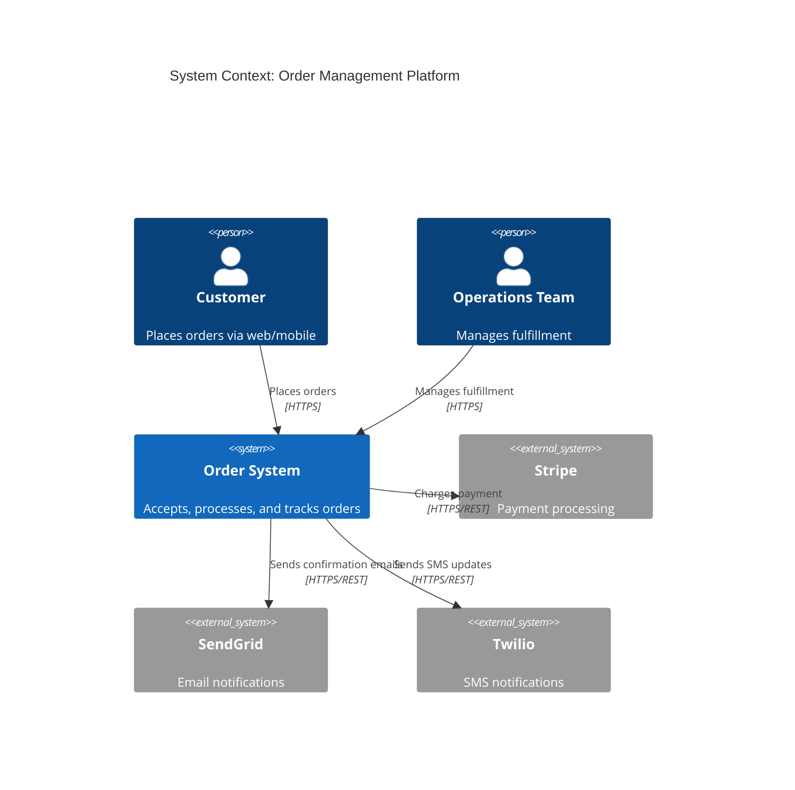

### C4 Level 2 — Container (Mermaid)

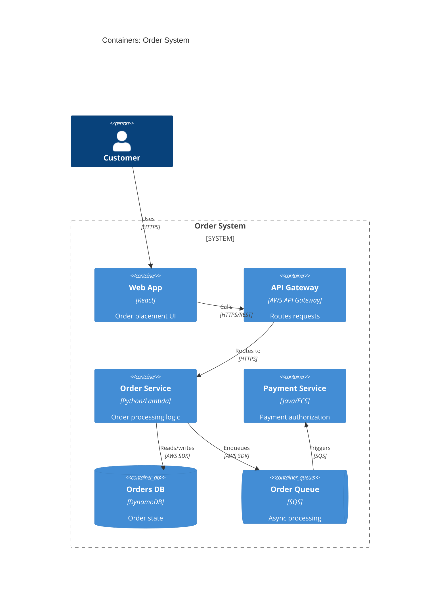

---

## Sequence Diagrams: Best for Request/Response Chains and Inter-Service Flows

Sequence diagrams show **who talks to whom, in what order, over time**. They answer the question "what happens when the user does X?" by tracing every hop from user action to data store and back. This is the diagram to reach for when documenting:

- Request/response chains (end-to-end from user click to response)
- Microservice calls (service A calls B calls C)
- API orchestration (one service fan-out to multiple downstream services)
- Timing and ordering of async actions (what fires first, what waits for what)

**Good for**: "What happens when the user clicks Submit?"

---

### Full-Stack User Action: The Core Use Case

The most valuable sequence diagram traces a user action all the way through the stack — from browser to frontend to API to database to external service and back. This is the diagram AI tools need most when generating integration code, because it shows every system involved and the exact protocol at each hop.

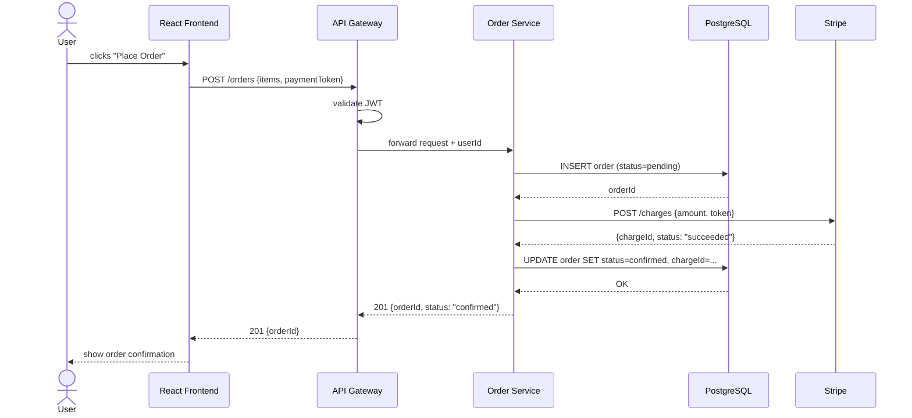

**What AI learns from this**: every system involved, the JWT validation step at the gateway, the two-phase DB write (pending → confirmed), the Stripe call in the middle, and the exact response shape returned to the user — without reading five separate files.

---

### Microservice Calls: Service-to-Service Chain

When one service calls several others in sequence, a sequence diagram makes the dependency order explicit:

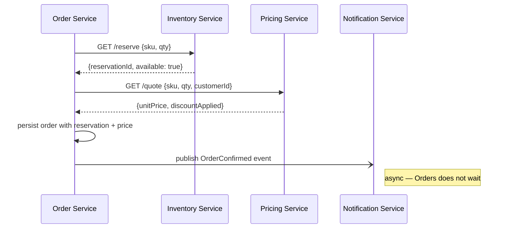

Arrow types in Mermaid sequence diagrams:

| Arrow | Syntax | Meaning |
|-------|--------|---------|
| Synchronous call | `->>` | Caller waits for response |
| Response | `-->>` | Return value |
| Async / fire-and-forget | `-)` | Caller does not wait |
| Note | `Note right of X: text` | Annotation |

---

### API Orchestration: Fan-Out to Multiple Downstream Services

When a single endpoint fans out to several services, show all parallel or sequential calls explicitly:

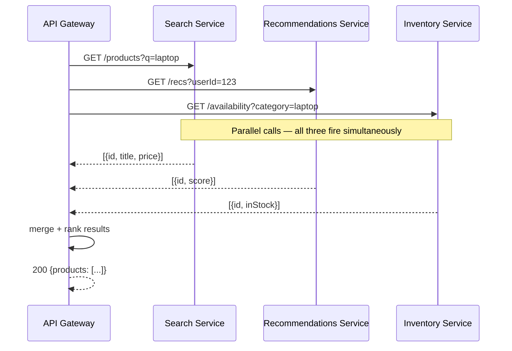

For truly parallel calls, add a note to make the concurrency explicit — the diagram syntax alone does not enforce ordering.

---

### Async Flows: Webhooks and Callbacks

When a response comes back asynchronously (webhook, polling, event), show the two phases separately:

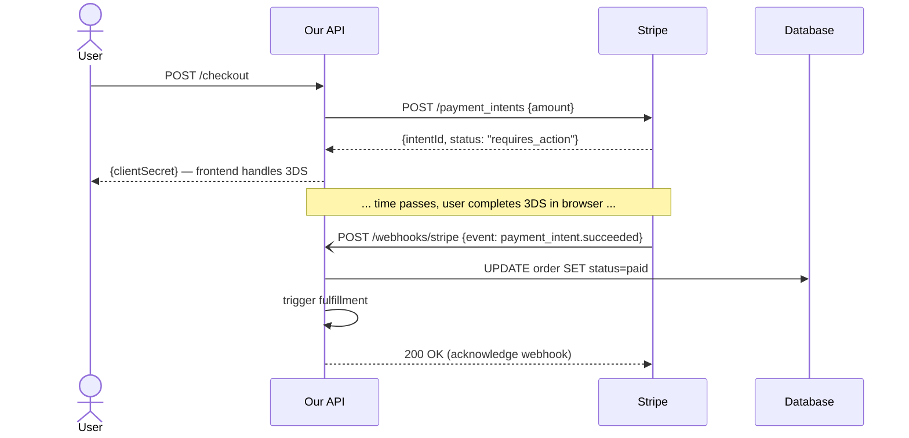

This pattern — synchronous initiation, asynchronous completion via webhook — is one of the most common sources of bugs in payment integrations. Documenting it explicitly prevents AI tools from generating code that assumes the payment is complete on the first response.

---

### Original Example: Backend Service Flow

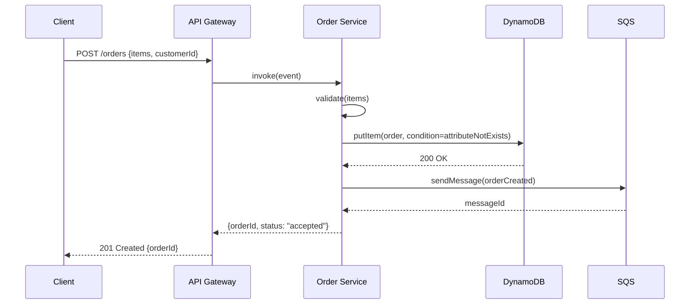

**What AI learns from this**: the exact call chain, the conditional DynamoDB write, the async queue pattern, and the response shape — all in one readable artifact.

---

### Sequence Diagram Best Practices for AI

- Use `participant` aliases that match your actual class/service/component names
- Label every arrow with the method, endpoint, or event being sent
- Show return arrows (`-->>`) for all synchronous responses; omit only for true fire-and-forget
- Include `actor User` (or `actor Browser`) as the starting participant for user-initiated flows
- Mark async calls with `-)` and add a `Note` explaining why there is no immediate response
- Include error paths as `alt`/`else` blocks for the most common failure modes:

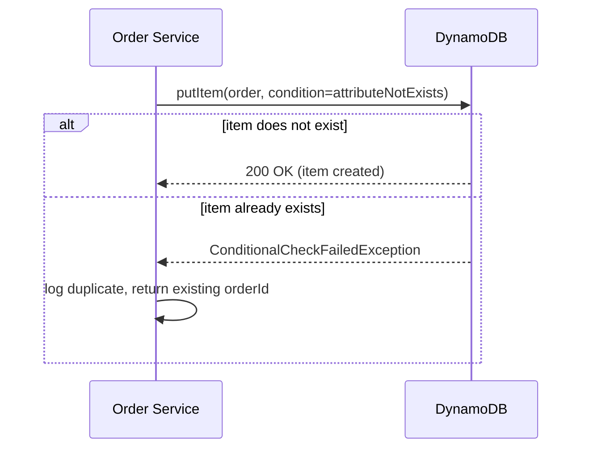

---

## Entity-Relationship Diagrams: Best for Data Models

ERDs tell AI tools what fields exist, their types, and how entities relate — critical for generating correct queries and migrations.

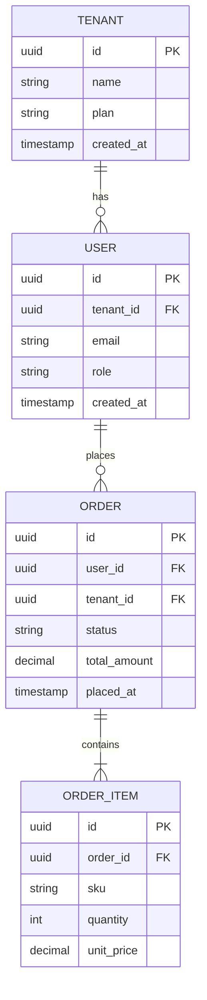

**Why this matters for AI**: an AI with the ERD will generate `JOIN` conditions correctly, know which foreign keys exist, and understand cardinality — without reading the raw migration files.

---

## ASCII / Text Art: No-Dependency Option

For CLAUDE.md, code comments, and ADRs where Mermaid may not render, ASCII diagrams are universally readable by all AI tools. They are always parseable as text.

```
Data Flow:

Client
  │ HTTPS POST /orders
  ▼
API Gateway ──── validates auth ──▶ 401 if invalid
  │
  │ Lambda invoke
  ▼
Order Service
  │                     │
  │ DynamoDB PutItem    │ SQS SendMessage
  ▼                     ▼
Orders Table       Order Queue
                        │
                        │ Lambda trigger
                        ▼
                   Payment Service
```

### ASCII Best Practices for AI

- Label every arrow with the operation being performed
- Use consistent arrow styles (`──▶`, `│`, `▼`) within a diagram
- Add a one-line title or caption above the diagram
- Keep diagrams narrow enough to read without horizontal scrolling (≤80 chars)
- Use box-drawing characters (`┌─┐│└─┘`) for component boxes:

```
┌──────────────┐     ┌──────────────┐     ┌──────────────┐
│  Web Client  │────▶│ API Gateway  │────▶│Order Service │
└──────────────┘     └──────────────┘     └──────┬───────┘
                                                  │
                                         ┌────────▼───────┐
                                         │   DynamoDB     │
                                         └────────────────┘
```

---

## Control Flow Diagrams: Best for Logic, Branching, and Process Steps

Control flow diagrams answer **"what happens, in what order, and under what conditions?"** They show the step-by-step logic of a function, algorithm, or business process — including branches, loops, and error paths. This is distinct from sequence diagrams (which show *who* calls *whom*) and state machines (which show *what state* an object is in).

Use a control flow diagram when you want to document:
- Branching logic (if/else, switch)
- Loops and retries
- Error and exception paths
- Business rules with multiple conditions
- The internal logic of a non-obvious function

**Good for**: "What does this function or process do step by step?"

### Types of Control Flow Diagrams

| Type | Best For | Format |
|------|---------|--------|
| Flowchart | General branching and sequencing | Mermaid `flowchart` |
| Decision tree | Multi-condition branching with clear outcomes | Mermaid `flowchart` or ASCII |
| Activity diagram | Processes with loops, parallel paths, and swim lanes | Mermaid `flowchart` with subgraphs |

---

### Flowchart: Branching Logic

Use when a function has conditional paths that affect what happens next.

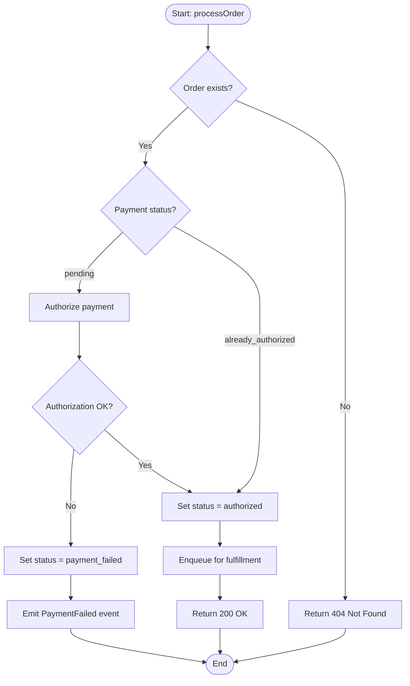

**What AI learns from this**: the exact decision points, all branches including failures, the event emitted on failure, and the happy path — without reading the implementation.

#### Mermaid Flowchart Syntax Cheatsheet

| Element | Syntax | Renders As |
|---------|--------|-----------|
| Start/end | `([label])` | Rounded pill |
| Process step | `[label]` | Rectangle |
| Decision | `{label?}` | Diamond |
| Arrow with label | `-- label -->` | Labeled edge |
| Yes/No branches | `-- Yes -->` / `-- No -->` | Labeled branches |

---

### Decision Tree: Multi-Condition Branching

Use when the logic is a series of conditions with distinct leaf outcomes — common for validation, routing, and classification logic.

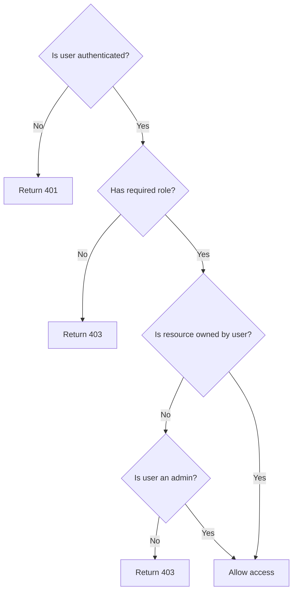

Decision trees can also be written as **ASCII text** for use in CLAUDE.md, code comments, and ADRs where Mermaid may not render:

```
Authorize request:
├── authenticated? No  → 401 Unauthorized
└── authenticated? Yes
    ├── has role? No   → 403 Forbidden
    └── has role? Yes
        ├── owns resource? Yes         → allow
        └── owns resource? No
            ├── is admin? Yes          → allow
            └── is admin? No           → 403 Forbidden
```

ASCII decision trees are the most AI-readable form of branching logic — they are plain text, require no rendering, and map directly onto if/else and switch structures in code.

---

### Activity Diagram: Loops and Retry Logic

Use when a process has loops, retries, or parallel steps. Mermaid flowcharts approximate activity diagrams using back-edges and subgraphs.

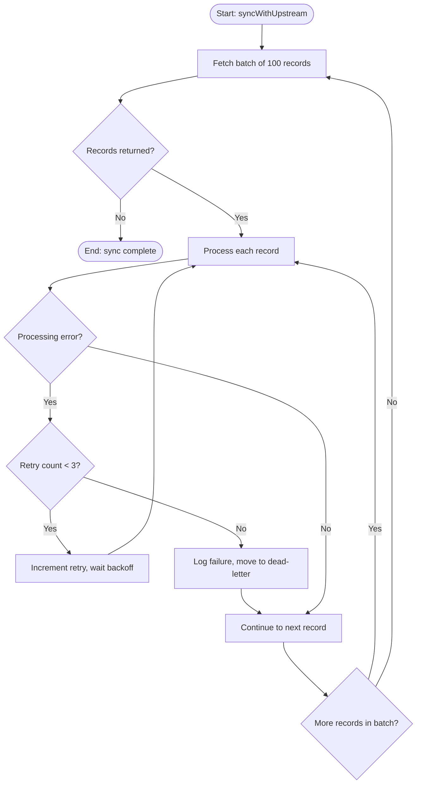

Key patterns to show in activity diagrams:
- **Retry loops**: back-edge from error handler to the step being retried
- **Batch iteration**: loop back to fetch after completing a batch
- **Dead-letter / skip**: explicit path for unrecoverable failures that keeps the process moving

---

### Error Path Documentation

Error paths are the most commonly omitted part of control flow diagrams. For AI-readable documentation, always include:

1. The **happy path** (all conditions satisfied)
2. **Validation failures** (bad input, missing required fields)
3. **Downstream failures** (external service errors, timeouts)
4. **Conflict/race conditions** (duplicate, stale state)

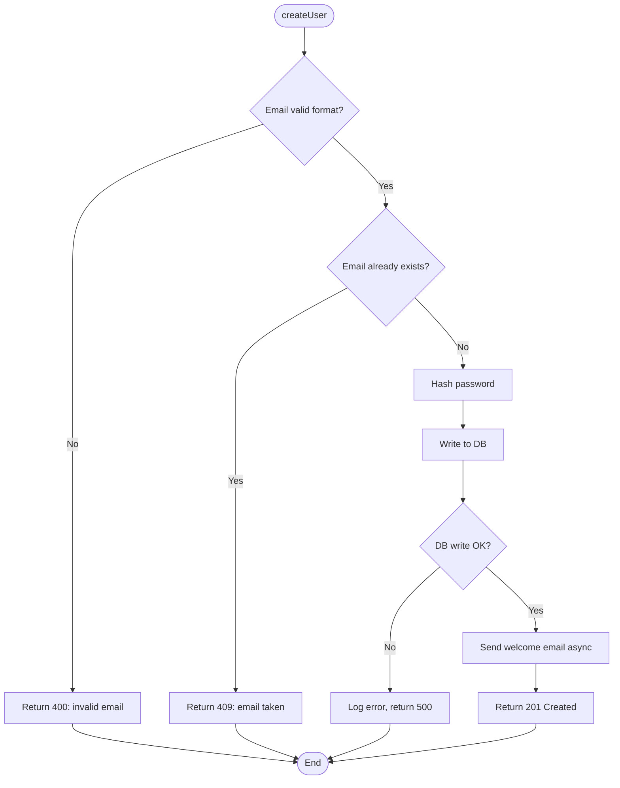

---

### Control Flow in Code Comments (ASCII)

For functions where the logic is non-obvious, embed a mini control flow diagram directly in the source as a block comment:

```typescript
/**
 * Resolves the effective price for a line item.
 *
 * Logic:
 *   hasCustomerDiscount? Yes → apply discount to base price
 *                        No  → use base price
 *       └── price < minimumMargin?
 *             Yes → use minimumMargin (floor enforcement)
 *             No  → use computed price
 */
function resolvePrice(item: LineItem, customer: Customer): number { ... }
```

AI tools read docblock comments and will follow this logic when generating code that calls or modifies the function.

---

## State Diagrams: Best for Object Lifecycle

When AI generates code that creates or transitions objects, it needs to know the valid states and allowed transitions. State diagrams provide this:

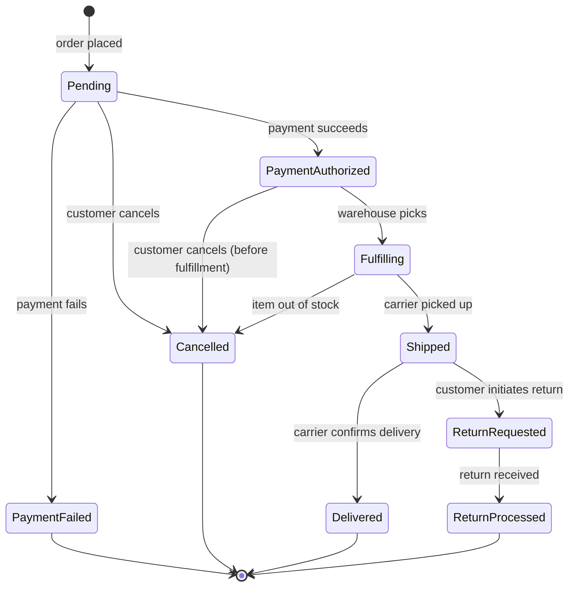

**What AI learns**: valid status values, which transitions are allowed, and implicitly which transitions are NOT valid (e.g., `Shipped → Pending` is not in the diagram → don't generate that code).

---

## Class Diagrams: Best for OOP Structure

For object-oriented codebases, class diagrams communicate inheritance, composition, and interface relationships:

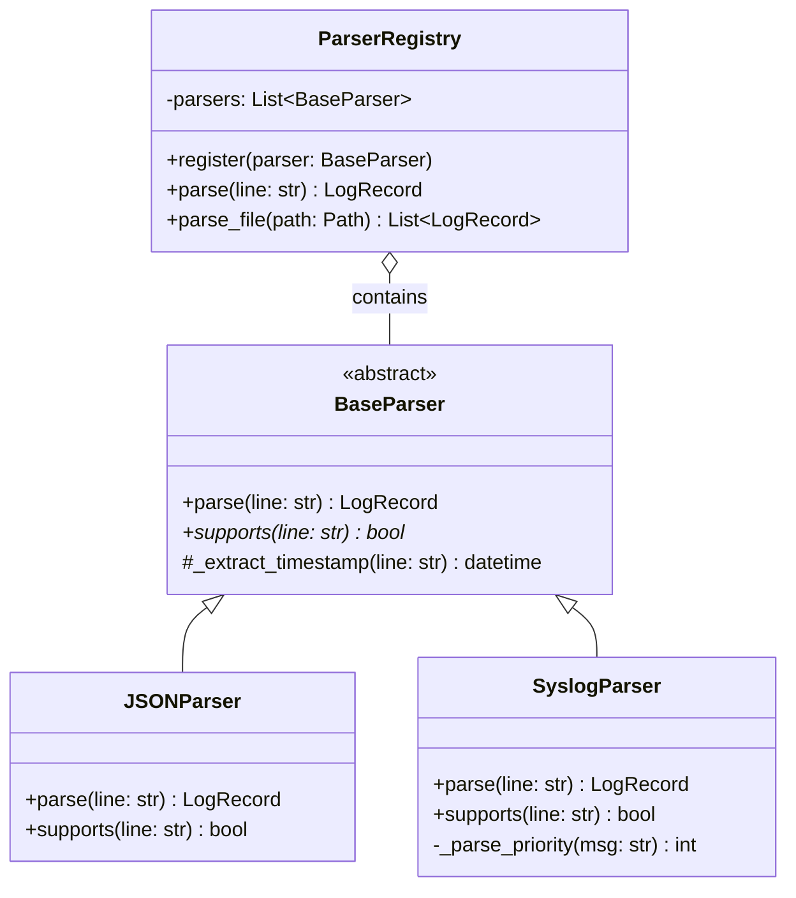

---

## Diagram Placement Strategy

| Diagram | Where It Lives | When AI Uses It |
|---------|---------------|----------------|
| C4 L1 System Context | `docs/ARCHITECTURE.md` or `ARCHITECTURE.md` | Understanding system boundary |
| C4 L2 Container | `docs/ARCHITECTURE.md` | Understanding service topology |
| Sequence (key flows) | `docs/ARCHITECTURE.md` or `docs/flows/` | Generating integration code |
| ERD | `docs/ARCHITECTURE.md` or `docs/schema.md` | Writing queries and migrations |
| State machine | `docs/ARCHITECTURE.md` or inline in model class | Generating state transition code |
| Class diagram | Per-module `README.md` or `docs/` | Navigating OOP structure |
| ASCII flow | `CLAUDE.md`, ADRs, code comments | Always-available context |

---

## What Makes a Diagram AI-Readable

Regardless of format, AI tools extract more value from diagrams that follow these rules:

1. **Label every node with the actual name** — use `Order Service`, not `Service B`
2. **Label every arrow with the operation** — `calls validateOrder()`, not just `→`
3. **One concept per diagram** — don't combine architecture + sequence + ERD into one
4. **Include a title** — a single sentence above the diagram stating what question it answers
5. **Match names to code** — use the same class/service/table names as in the actual codebase; diagrams that use aliases diverge from reality and mislead AI
6. **Text summary alongside** — for complex diagrams, add 3–5 bullet points below summarizing the key relationships in prose; AI can cross-reference text + diagram

---

## Quick Reference: Diagram Type → Question Answered

| Question | Diagram Type |
|----------|-------------|
| What does this system do and who uses it? | C4 L1 Context |
| What services/apps make up the system? | C4 L2 Container |
| What components are inside a service? | C4 L3 Component |
| What calls what, in what order? | Sequence diagram |
| What happens when the user clicks X? | Sequence diagram (full-stack: user → frontend → API → DB → external service) |
| How do these microservices talk to each other? | Sequence diagram (service-to-service chain) |
| What fires synchronously vs. asynchronously? | Sequence diagram with `->>` vs `-)` arrows |
| What fields/tables exist and how are they related? | ERD |
| What states can an object be in and how does it transition? | State machine |
| What classes exist and how do they relate? | Class diagram |
| How does data move from A to B? | Flowchart or ASCII flow |
| What are the valid inputs/outputs at each step? | Flowchart with decision nodes |
| What does this function or process do step by step? | Control flow diagram (flowchart) |
| What are all the branches and conditions in this logic? | Decision tree (flowchart or ASCII) |
| What happens in loops and retries? | Activity diagram (flowchart with back-edges) |
| What are the error and failure paths? | Flowchart — always include alongside happy path |
