# Diagrams for AI-Readable Codebases
## Types, Formats, and Best Practices for Diagrams That Both Humans and AI Can Use

---

## The Core Problem: Most Diagrams Are Invisible to AI

A PNG or SVG diagram exported from draw.io, Lucidchart, or Excalidraw is an image file. AI coding assistants that lack vision capabilities cannot read it at all. Even AI tools with vision capabilities extract meaning from images unreliably — they may miss labels, misread relationships, or skip diagrams entirely when processing many files.

**The rule**: for documentation that AI tools should be able to use, use text-based diagram formats embedded directly in Markdown. Text-based diagrams are:
- Always readable by any AI tool
- Version-controllable (diffs show what changed)
- Rendered visually in GitHub, GitLab, and documentation sites
- Editable without a separate tool

---

## Diagram Format Decision

```
Do you need the diagram to be AI-readable?
├── Yes (architecture docs, CLAUDE.md references, code comments)
│   ├── Simple flow or relationship → ASCII art (zero dependencies)
│   ├── Component/flow/sequence/state/ERD → Mermaid (GitHub-native, widely supported)
│   ├── Detailed UML → PlantUML (powerful; requires server/plugin)
│   └── C4 model (multi-level architecture) → Mermaid C4 or structured text
└── No (design/UX, presentations, external stakeholder docs)
    └── Any tool is fine: Excalidraw, draw.io, Figma, Lucidchart
        └── Export PNG/SVG for embedding; keep source file in repo
```

---

## Mermaid: The Default Choice for AI-Readable Diagrams

Mermaid is a text-based diagramming language that renders natively in GitHub, GitLab, Notion, Obsidian, and most documentation site generators. It lives in fenced code blocks — no external tool needed.

````markdown
```mermaid
[diagram definition]
```
````

GitHub renders these automatically. AI tools read the raw Mermaid syntax and understand it as a structured description of relationships.

### Mermaid Diagram Types

| Diagram Type | Mermaid Keyword | Best For |
|-------------|----------------|---------|
| Flowchart | `flowchart LR` / `graph TD` | Data flow, decision logic, process steps |
| Sequence | `sequenceDiagram` | API calls, inter-service communication, request/response |
| Entity-Relationship | `erDiagram` | Database schema, data model relationships |
| Class | `classDiagram` | Object model, inheritance, composition |
| State machine | `stateDiagram-v2` | Object lifecycle, workflow states |
| C4 Context | `C4Context` | System landscape, who uses what |
| C4 Container | `C4Container` | Services/apps within a system boundary |
| Git graph | `gitGraph` | Branching strategy |
| Gantt | `gantt` | Roadmap (rarely needed in code docs) |

---

## The C4 Model: Best Framework for Architecture Documentation

The C4 model (by Simon Brown) describes architecture at four levels of zoom. For AI tool comprehension, the first three levels are most valuable:

| Level | Question Answered | Audience |
|-------|-----------------|---------|
| **L1: System Context** | What does this system do, and who/what interacts with it? | Anyone |
| **L2: Container** | What applications/services make up the system? | Developers, architects |
| **L3: Component** | What major components exist inside a container? | Developers |
| **L4: Code** | How is a component implemented? | Usually generated from code |

### Why C4 Works Well for AI

C4 forces you to think at multiple levels of abstraction. When an AI tool reads L1 + L2 diagrams, it understands:
- What the system's external boundary is (prevents generating code that calls the wrong system)
- What the major services are and their responsibilities (prevents generating code in the wrong layer)
- What external dependencies exist (informs which SDKs and APIs to use)

### C4 Level 1 — System Context Diagram

The context diagram is the **most important single diagram** for any system. It shows the system as one box in the center, surrounded by everything it interacts with — users, external services, upstream systems, downstream consumers. It answers "what is inside vs outside the system?"

Use a context diagram when documenting:
- **System boundaries** — what this team builds and owns vs what is external
- **External dependencies** — every service, API, or system you rely on
- **Integrations** — who sends data in, who receives data out
- **Actors** — every person or system that interacts with yours

**Good for**: "What is inside vs outside the system?"

#### C4 Context (Mermaid)

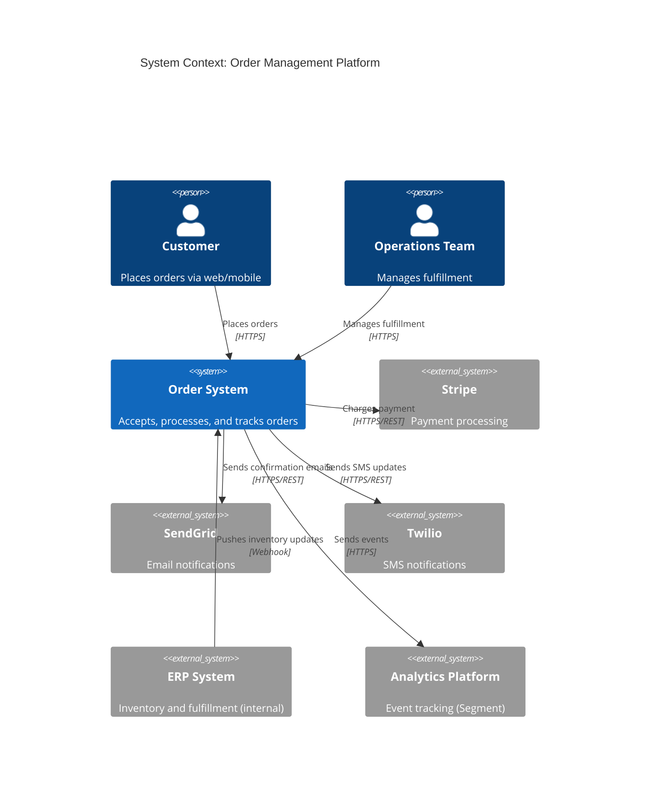
```mermaid
C4Context
  title System Context: Order Management Platform

  Person(customer, "Customer", "Places orders via web/mobile")
  Person(ops, "Operations Team", "Manages fulfillment")

  System(orderSystem, "Order System", "Accepts, processes, and tracks orders")

  System_Ext(stripe, "Stripe", "Payment processing")
  System_Ext(sendgrid, "SendGrid", "Email notifications")
  System_Ext(twilio, "Twilio", "SMS notifications")
  System_Ext(erp, "ERP System", "Inventory and fulfillment (internal)")
  System_Ext(analytics, "Analytics Platform", "Event tracking (Segment)")

  Rel(customer, orderSystem, "Places orders", "HTTPS")
  Rel(ops, orderSystem, "Manages fulfillment", "HTTPS")
  Rel(orderSystem, stripe, "Charges payment", "HTTPS/REST")
  Rel(orderSystem, sendgrid, "Sends confirmation emails", "HTTPS/REST")
  Rel(orderSystem, twilio, "Sends SMS updates", "HTTPS/REST")
  Rel(erp, orderSystem, "Pushes inventory updates", "Webhook")
  Rel(orderSystem, analytics, "Sends events", "HTTPS")
```

**What AI learns from this**: the system boundary (everything inside `orderSystem` is ours, everything outside is not), who the users are, which external services we depend on, and the direction of each data flow.

#### Context Diagram Without C4 (Flowchart)

For teams not using C4 notation, a Mermaid flowchart with a central subgraph achieves the same result:

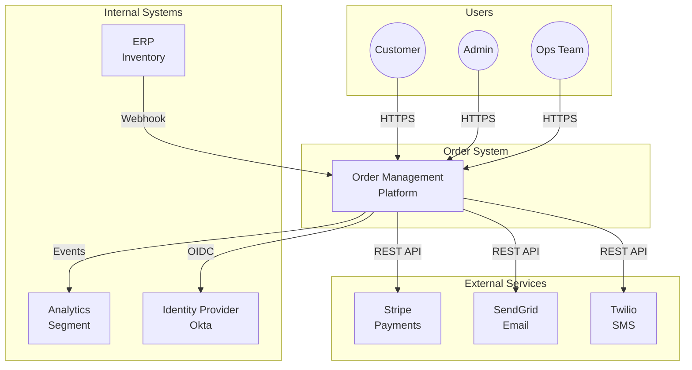
```mermaid
flowchart TD
  subgraph Users
    customer((Customer))
    admin((Admin))
    ops((Ops Team))
  end

  subgraph "Order System"
    system[Order Management<br/>Platform]
  end

  subgraph "External Services"
    stripe[Stripe<br/>Payments]
    sendgrid[SendGrid<br/>Email]
    twilio[Twilio<br/>SMS]
  end

  subgraph "Internal Systems"
    erp[ERP<br/>Inventory]
    analytics[Analytics<br/>Segment]
    idp[Identity Provider<br/>Okta]
  end

  customer -->|"HTTPS"| system
  admin -->|"HTTPS"| system
  ops -->|"HTTPS"| system
  system -->|"REST API"| stripe
  system -->|"REST API"| sendgrid
  system -->|"REST API"| twilio
  erp -->|"Webhook"| system
  system -->|"Events"| analytics
  system -->|"OIDC"| idp
```

Use `(( ))` for human actors, `[ ]` for systems. Group by relationship type (users, external vendors, internal systems) using subgraphs.

---

#### Categorizing External Dependencies

When building a context diagram, classify each external entity. This determines how you document it and what risks it carries:

| Category | Examples | What to Document | Risk Level |
|----------|----------|-----------------|------------|
| **Users** (human actors) | Customer, Admin, Operator | Role, what they do, auth method | Low (you control the interface) |
| **Upstream systems** (push data in) | ERP, CRM, data feeds, webhooks | Event/payload format, frequency, retry behavior | Medium (you don't control when they send) |
| **Downstream consumers** (pull data out) | Analytics, data warehouse, partner APIs | What data they consume, SLA expectations | Low (they adapt to you) |
| **Vendor services** (you call them) | Stripe, SendGrid, Twilio, AWS S3 | API version, auth method, rate limits, SLA | High (outage = your outage) |
| **Identity / auth providers** | Okta, Auth0, Active Directory | Protocol (OIDC, SAML), token format, session rules | High (outage = nobody can log in) |
| **Internal platform services** | Shared database, service mesh, secrets manager | Ownership, versioning, who to contact | Medium (shared dependency) |

#### External Dependency Inventory Table

Pair every context diagram with an inventory table. The diagram shows topology; the table shows operational details:

```markdown
## External Dependencies

| Dependency | Category | Protocol | Auth | Direction | SLA | Failure Impact |
|-----------|----------|----------|------|-----------|-----|---------------|
| Stripe | Vendor | HTTPS/REST | API key | Outbound | 99.99% | Cannot process payments |
| SendGrid | Vendor | HTTPS/REST | API key | Outbound | 99.95% | Email notifications delayed |
| Twilio | Vendor | HTTPS/REST | API key | Outbound | 99.95% | SMS notifications delayed |
| ERP System | Internal upstream | Webhook | mTLS | Inbound | 99.9% | Inventory data stale |
| Okta | Identity provider | OIDC | OAuth2 | Both | 99.99% | No user can authenticate |
| Segment | Analytics | HTTPS | Write key | Outbound | 99.9% | Analytics events lost |
```

**Why this matters for AI**: when generating integration code, AI needs to know the protocol, auth method, and which direction the data flows. When generating error handling, it needs to know the failure impact to decide whether to use a circuit breaker, retry, or fail fast.

---

#### Multi-System Landscape (C4 System Landscape)

When your system is one of several in an organization, a System Landscape diagram shows how all systems relate. This is the "map of all maps" — one zoom level above the context diagram.

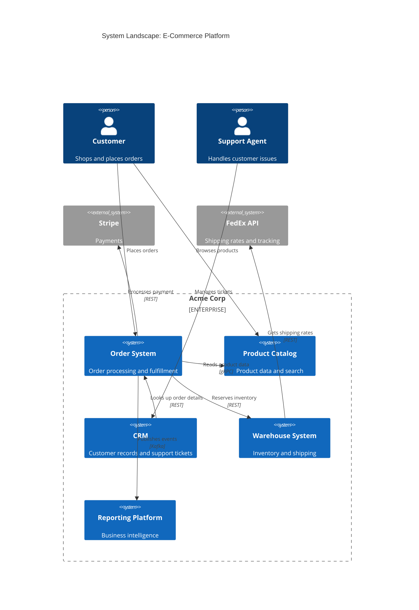
```mermaid
C4Context
  title System Landscape: E-Commerce Platform

  Person(customer, "Customer", "Shops and places orders")
  Person(support, "Support Agent", "Handles customer issues")

  Enterprise_Boundary(company, "Acme Corp") {
    System(orders, "Order System", "Order processing and fulfillment")
    System(catalog, "Product Catalog", "Product data and search")
    System(crm, "CRM", "Customer records and support tickets")
    System(warehouse, "Warehouse System", "Inventory and shipping")
    System(reporting, "Reporting Platform", "Business intelligence")
  }

  System_Ext(stripe, "Stripe", "Payments")
  System_Ext(fedex, "FedEx API", "Shipping rates and tracking")

  Rel(customer, catalog, "Browses products")
  Rel(customer, orders, "Places orders")
  Rel(support, crm, "Manages tickets")
  Rel(orders, catalog, "Reads product data", "gRPC")
  Rel(orders, warehouse, "Reserves inventory", "REST")
  Rel(orders, stripe, "Processes payment", "REST")
  Rel(warehouse, fedex, "Gets shipping rates", "REST")
  Rel(orders, reporting, "Publishes events", "Kafka")
  Rel(crm, orders, "Looks up order details", "REST")
```

**When to create**: When developers need to understand where their system fits in the larger organization, or when cross-team dependencies need to be visible. Particularly valuable during onboarding.

---

#### Reverse-Engineering Context from Code

When analyzing an existing codebase to build a context diagram, look for external boundaries in these locations:

| Source | What It Reveals | Example |
|--------|----------------|---------|
| Environment variables | External service URLs, API keys | `STRIPE_API_KEY`, `DATABASE_URL`, `SENDGRID_HOST` |
| Config files | Service endpoints, connection strings | `application.yml`, `config/production.json` |
| SDK/client imports | Vendor integrations | `import stripe`, `require('twilio')`, `@aws-sdk/client-s3` |
| HTTP client instantiation | Outbound service calls | `axios.create({ baseURL: config.erpUrl })` |
| Webhook/callback endpoints | Inbound integrations | `POST /webhooks/stripe`, `POST /api/erp-events` |
| Auth middleware config | Identity provider | `passport.use(new OidcStrategy({ issuer: 'okta.com' }))` |
| Docker compose | Infrastructure dependencies | `services: postgres:`, `services: redis:` |
| CI/CD config | Deployment targets, external service setup | `deploy-to: aws`, `setup-stripe-webhook` |
| CORS configuration | Which frontends/origins are allowed | `cors({ origin: ['app.example.com'] })` |
| Network policies / security groups | What can talk to what | Terraform, k8s NetworkPolicy |

**Process**:
1. Grep for environment variables containing `URL`, `HOST`, `ENDPOINT`, `KEY`, `SECRET`
2. Scan import statements for external SDK packages
3. Find all HTTP client instantiations and their base URLs
4. List all webhook/callback route handlers
5. Read docker-compose for infrastructure services
6. Check auth middleware for identity provider config
7. Place your system in the center, group everything else by category, draw arrows with protocols

---

#### Context Diagram in ASCII

For CLAUDE.md and code comments:

```
System Context: Order Management Platform

                    ┌──────────┐
                    │ Customer │
                    └────┬─────┘
                         │ HTTPS
    ┌──────────┐    ┌────▼──────────────┐    ┌──────────┐
    │   Okta   │◄───│                   │───▶│  Stripe  │
    │  (OIDC)  │    │   Order System    │    │(payments)│
    └──────────┘    │                   │    └──────────┘
                    │   [our system]    │
    ┌──────────┐    │                   │    ┌──────────┐
    │   ERP    │───▶│                   │───▶│ SendGrid │
    │(webhooks)│    └───────────────────┘    │ (email)  │
    └──────────┘              │              └──────────┘
                              │ events
                     ┌────────▼────────┐
                     │    Segment      │
                     │  (analytics)    │
                     └─────────────────┘

Inside the boundary: Order System (we build and own this)
Outside: everything else (we depend on or serve)
```

---

#### Context Diagram Best Practices for AI

1. **Draw the boundary first** — decide what is "ours" before adding anything else; if you can't define the boundary, the architecture is unclear
2. **Show direction on every arrow** — inbound (they call us) vs outbound (we call them) vs bidirectional; this determines who handles retries and failures
3. **Include the protocol** — HTTPS, gRPC, WebSocket, Webhook, Kafka, SQL; AI uses this to generate correct client code
4. **Categorize external entities** — users, upstream, downstream, vendors, identity; use subgraphs or the inventory table
5. **Pair with dependency inventory table** — the diagram shows topology, the table shows SLA, auth, and failure impact
6. **Include internal platform dependencies** — shared databases, service meshes, and secret managers are external to your system boundary even if they're internal to the company
7. **Update when integrations change** — context diagrams change slowly but they do change; add new dependencies as they're integrated
8. **One system per diagram** — if you need to show multiple systems, use the System Landscape level; don't cram everything into one context diagram

---

### C4 Level 2 — Container (Mermaid)

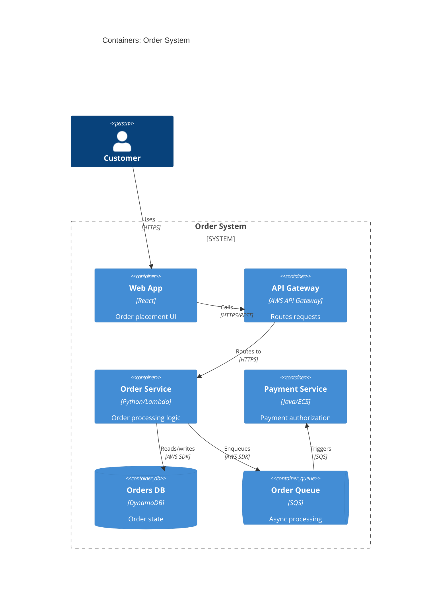
```mermaid
C4Container
  title Containers: Order System

  Person(customer, "Customer")

  System_Boundary(orderSystem, "Order System") {
    Container(webApp, "Web App", "React", "Order placement UI")
    Container(apiGateway, "API Gateway", "AWS API Gateway", "Routes requests")
    Container(orderService, "Order Service", "Python/Lambda", "Order processing logic")
    Container(paymentService, "Payment Service", "Java/ECS", "Payment authorization")
    ContainerDb(orderDb, "Orders DB", "DynamoDB", "Order state")
    ContainerQueue(orderQueue, "Order Queue", "SQS", "Async processing")
  }

  Rel(customer, webApp, "Uses", "HTTPS")
  Rel(webApp, apiGateway, "Calls", "HTTPS/REST")
  Rel(apiGateway, orderService, "Routes to", "HTTPS")
  Rel(orderService, orderDb, "Reads/writes", "AWS SDK")
  Rel(orderService, orderQueue, "Enqueues", "AWS SDK")
  Rel(orderQueue, paymentService, "Triggers", "SQS")
```

---

### C4 Level 3 — Component (Mermaid)

Zooms into a single container to show its internal building blocks. Use this when the container is complex enough that "Order Service" is not a sufficient explanation — you need to show the modules, their responsibilities, and how they wire together.

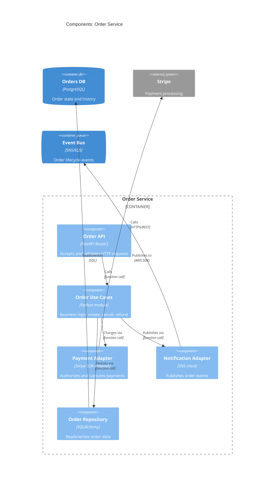
```mermaid
C4Component
  title Components: Order Service

  Container_Boundary(orderService, "Order Service") {
    Component(orderApi, "Order API", "FastAPI Router", "Accepts and validates HTTP requests")
    Component(orderUseCase, "Order Use Cases", "Python module", "Business logic: create, cancel, refund")
    Component(paymentAdapter, "Payment Adapter", "Stripe SDK wrapper", "Authorizes and captures payments")
    Component(notificationAdapter, "Notification Adapter", "SNS client", "Publishes order events")
    Component(orderRepo, "Order Repository", "SQLAlchemy", "Reads/writes order data")
  }

  ContainerDb(db, "Orders DB", "PostgreSQL", "Order state and history")
  System_Ext(stripe, "Stripe", "Payment processing")
  ContainerQueue(eventBus, "Event Bus", "SNS/SQS", "Order lifecycle events")

  Rel(orderApi, orderUseCase, "Calls", "function call")
  Rel(orderUseCase, orderRepo, "Persists via", "function call")
  Rel(orderUseCase, paymentAdapter, "Charges via", "function call")
  Rel(orderUseCase, notificationAdapter, "Publishes via", "function call")
  Rel(orderRepo, db, "Reads/writes", "SQL")
  Rel(paymentAdapter, stripe, "Calls", "HTTPS/REST")
  Rel(notificationAdapter, eventBus, "Publishes to", "AWS SDK")
```

**What AI learns from this**: the Order Service is not a monolithic blob — it has distinct layers (API → Use Cases → Adapters → External). The payment logic is isolated behind an adapter, so changing payment providers means touching `paymentAdapter` only. The repository pattern means database access is centralized.

**When to create L3 diagrams**:
- The container has >3 distinct internal modules
- Multiple developers work inside the same container
- The container is a monolith (L2 shows one box — L3 is where the useful structure lives)
- You need to show which internal module talks to which external system

**When to skip L3**:
- The container is a thin wrapper (API gateway, proxy)
- The container's internals map obviously to a standard framework layout (e.g., a Rails app where the structure is conventional)

---

### Component Diagrams Without C4 (Simple Architecture Overviews)

Not every team uses C4 notation. For simpler "boxes and arrows" architecture diagrams — showing major building blocks, their technologies, and how they connect — use a Mermaid flowchart with subgraphs.

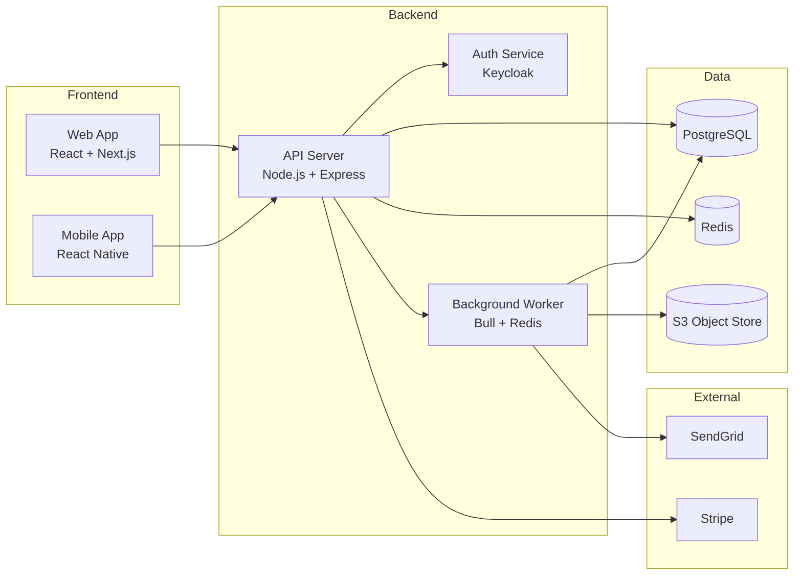
```mermaid
flowchart LR
  subgraph Frontend
    web[Web App<br/>React + Next.js]
    mobile[Mobile App<br/>React Native]
  end

  subgraph Backend
    api[API Server<br/>Node.js + Express]
    auth[Auth Service<br/>Keycloak]
    worker[Background Worker<br/>Bull + Redis]
  end

  subgraph Data
    db[(PostgreSQL)]
    cache[(Redis)]
    s3[(S3 Object Store)]
  end

  subgraph External
    stripe[Stripe]
    sendgrid[SendGrid]
  end

  web --> api
  mobile --> api
  api --> auth
  api --> db
  api --> cache
  api --> worker
  worker --> db
  worker --> s3
  api --> stripe
  worker --> sendgrid
```

**When to use this instead of C4**: When the audience is broad (product managers, new hires) and formal C4 notation would add friction. This style is also better for quick architecture sketches in ADRs and README files.

**Key rules for informal component diagrams**:
- Use `subgraph` to group related components (frontend, backend, data, external)
- Include the technology in each box (`Node.js + Express`, not just "API")
- Use `[(name)]` syntax for databases and stores to visually distinguish them
- Label arrows only when the protocol/purpose isn't obvious

---

### Monolith Component Map

For monoliths, the L2 Container diagram is just one box (plus a database). The interesting structure is inside. Use L3 or a flowchart to show the major modules, their boundaries, and dependency direction.

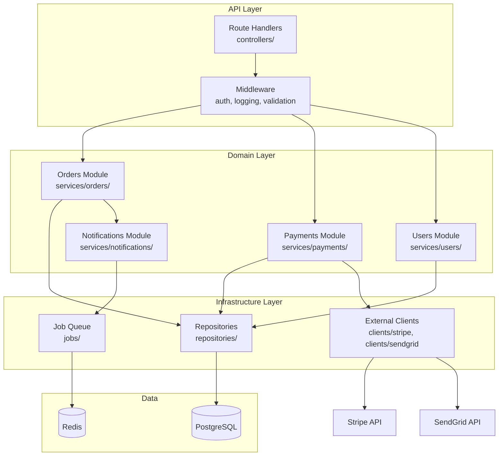
```mermaid
flowchart TD
  subgraph "API Layer"
    routes[Route Handlers<br/>controllers/]
    middleware[Middleware<br/>auth, logging, validation]
  end

  subgraph "Domain Layer"
    orders[Orders Module<br/>services/orders/]
    payments[Payments Module<br/>services/payments/]
    users[Users Module<br/>services/users/]
    notifications[Notifications Module<br/>services/notifications/]
  end

  subgraph "Infrastructure Layer"
    repo[Repositories<br/>repositories/]
    clients[External Clients<br/>clients/stripe, clients/sendgrid]
    queue[Job Queue<br/>jobs/]
  end

  subgraph "Data"
    db[(PostgreSQL)]
    redis[(Redis)]
  end

  routes --> middleware
  middleware --> orders
  middleware --> payments
  middleware --> users
  orders --> repo
  orders --> notifications
  payments --> repo
  payments --> clients
  notifications --> queue
  users --> repo
  repo --> db
  queue --> redis
  clients --> stripe[Stripe API]
  clients --> sendgrid[SendGrid API]
```

**What AI learns from this**: the layering rule (routes → domain → infrastructure → data), which domain modules exist, and that cross-module communication goes through `notifications` (not direct calls between domain modules).

Pair this diagram with a brief dependency rule statement:

```
Dependency rule:
  API Layer → Domain Layer → Infrastructure Layer → Data
  ✗ Infrastructure must never import from Domain
  ✗ Domain modules must never import from each other directly
  ✓ Cross-module communication goes through the Notifications module (events)
```

---

### Module Boundary Diagram with Ownership

For larger teams, show which team or person owns each component. Use a flowchart with subgraphs labeled by owner.

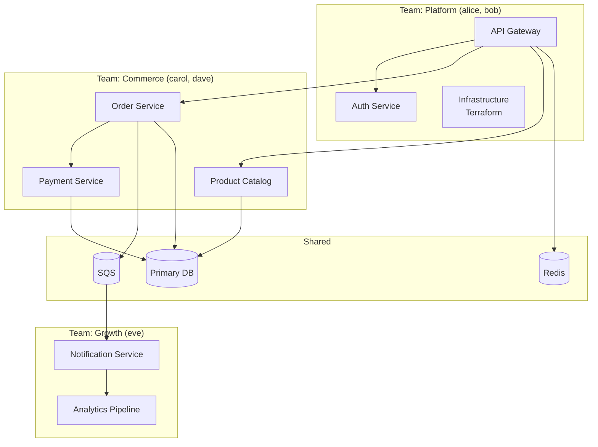
```mermaid
flowchart TD
  subgraph "Team: Platform (alice, bob)"
    api[API Gateway]
    auth[Auth Service]
    infra[Infrastructure<br/>Terraform]
  end

  subgraph "Team: Commerce (carol, dave)"
    orders[Order Service]
    payments[Payment Service]
    catalog[Product Catalog]
  end

  subgraph "Team: Growth (eve)"
    notifications[Notification Service]
    analytics[Analytics Pipeline]
  end

  subgraph "Shared"
    db[(Primary DB)]
    cache[(Redis)]
    queue[(SQS)]
  end

  api --> auth
  api --> orders
  api --> catalog
  orders --> payments
  orders --> queue
  queue --> notifications
  notifications --> analytics
  orders --> db
  catalog --> db
  payments --> db
  api --> cache
```

**What AI learns from this**: who to ask about what, which services are likely to change together (same team), and where cross-team dependencies exist (Commerce → Growth via the queue).

---

### Component Diagram in ASCII

For CLAUDE.md, ADRs, and code comments where Mermaid won't render:

```
Architecture Overview:

┌─────────────────────────────────────────────────────────┐
│                      Frontend                           │
│  ┌──────────────┐  ┌──────────────┐                    │
│  │   Web App    │  │  Mobile App  │                    │
│  │   (React)    │  │(React Native)│                    │
│  └──────┬───────┘  └──────┬───────┘                    │
└─────────┼─────────────────┼────────────────────────────┘
          │ HTTPS           │ HTTPS
┌─────────▼─────────────────▼────────────────────────────┐
│                      Backend                            │
│  ┌──────────────┐  ┌──────────────┐  ┌──────────────┐ │
│  │  API Server  │──│ Auth Service │  │   Worker     │ │
│  │  (Express)   │  │ (Keycloak)   │  │  (Bull)      │ │
│  └──────┬───────┘  └──────────────┘  └──────┬───────┘ │
└─────────┼────────────────────────────────────┼─────────┘
          │ SQL                                │ S3 API
┌─────────▼────────────────────────────────────▼─────────┐
│  ┌──────────────┐  ┌──────────────┐  ┌──────────────┐ │
│  │  PostgreSQL  │  │    Redis     │  │      S3      │ │
│  └──────────────┘  └──────────────┘  └──────────────┘ │
└────────────────────────────────────────────────────────┘
```

---

### Component Diagram Best Practices for AI

1. **Name components with their actual names** — use `OrderService` not `Service A`; use the directory or class name from code
2. **Include the technology** — `Python/FastAPI` not just "API"; AI uses this to generate framework-appropriate code
3. **Show the system boundary** — clearly separate internal components from external dependencies
4. **Label relationships with protocol/mechanism** — `HTTPS/REST`, `SQL`, `gRPC`, `function call`, `event`
5. **Group by layer or team** — use subgraphs to show architectural boundaries, not just topology
6. **State the dependency rule** — if layers exist, state which direction dependencies may flow
7. **One level of abstraction per diagram** — don't mix L2 containers with L4 class detail in one diagram; use separate diagrams at each level

---

## Sequence Diagrams: Best for Request/Response Chains and Inter-Service Flows

Sequence diagrams show **who talks to whom, in what order, over time**. They answer the question "what happens when the user does X?" by tracing every hop from user action to data store and back. This is the diagram to reach for when documenting:

- Request/response chains (end-to-end from user click to response)
- Microservice calls (service A calls B calls C)
- API orchestration (one service fan-out to multiple downstream services)
- Timing and ordering of async actions (what fires first, what waits for what)

**Good for**: "What happens when the user clicks Submit?"

---

### Full-Stack User Action: The Core Use Case

The most valuable sequence diagram traces a user action all the way through the stack — from browser to frontend to API to database to external service and back. This is the diagram AI tools need most when generating integration code, because it shows every system involved and the exact protocol at each hop.

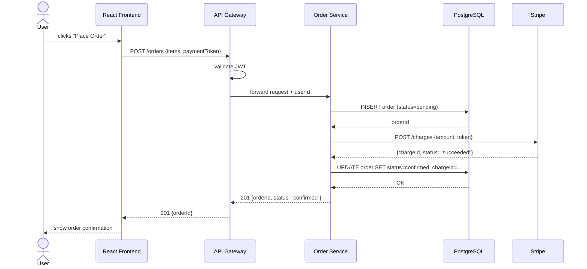
```mermaid
sequenceDiagram
  actor User
  participant FE as React Frontend
  participant GW as API Gateway
  participant API as Order Service
  participant DB as PostgreSQL
  participant Pay as Stripe

  User->>FE: clicks "Place Order"
  FE->>GW: POST /orders {items, paymentToken}
  GW->>GW: validate JWT
  GW->>API: forward request + userId
  API->>DB: INSERT order (status=pending)
  DB-->>API: orderId
  API->>Pay: POST /charges {amount, token}
  Pay-->>API: {chargeId, status: "succeeded"}
  API->>DB: UPDATE order SET status=confirmed, chargeId=...
  DB-->>API: OK
  API-->>GW: 201 {orderId, status: "confirmed"}
  GW-->>FE: 201 {orderId}
  FE-->>User: show order confirmation
```

**What AI learns from this**: every system involved, the JWT validation step at the gateway, the two-phase DB write (pending → confirmed), the Stripe call in the middle, and the exact response shape returned to the user — without reading five separate files.

---

### Microservice Calls: Service-to-Service Chain

When one service calls several others in sequence, a sequence diagram makes the dependency order explicit:

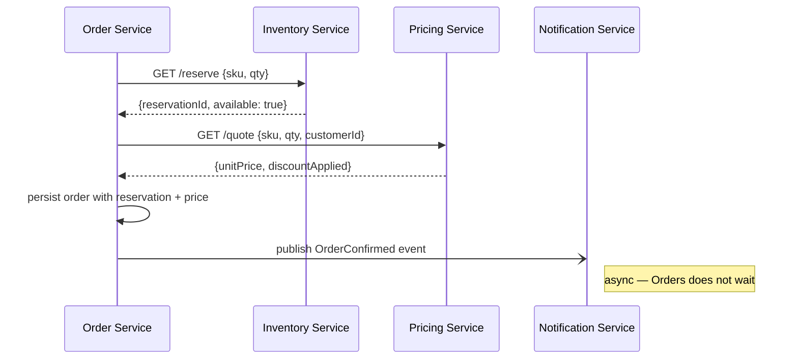
```mermaid
sequenceDiagram
  participant Orders as Order Service
  participant Inventory as Inventory Service
  participant Pricing as Pricing Service
  participant Notify as Notification Service

  Orders->>Inventory: GET /reserve {sku, qty}
  Inventory-->>Orders: {reservationId, available: true}
  Orders->>Pricing: GET /quote {sku, qty, customerId}
  Pricing-->>Orders: {unitPrice, discountApplied}
  Orders->>Orders: persist order with reservation + price
  Orders-)Notify: publish OrderConfirmed event
  Note right of Notify: async — Orders does not wait
```

Arrow types in Mermaid sequence diagrams:

| Arrow | Syntax | Meaning |
|-------|--------|---------|
| Synchronous call | `->>` | Caller waits for response |
| Response | `-->>` | Return value |
| Async / fire-and-forget | `-)` | Caller does not wait |
| Note | `Note right of X: text` | Annotation |

---

### API Orchestration: Fan-Out to Multiple Downstream Services

When a single endpoint fans out to several services, show all parallel or sequential calls explicitly:

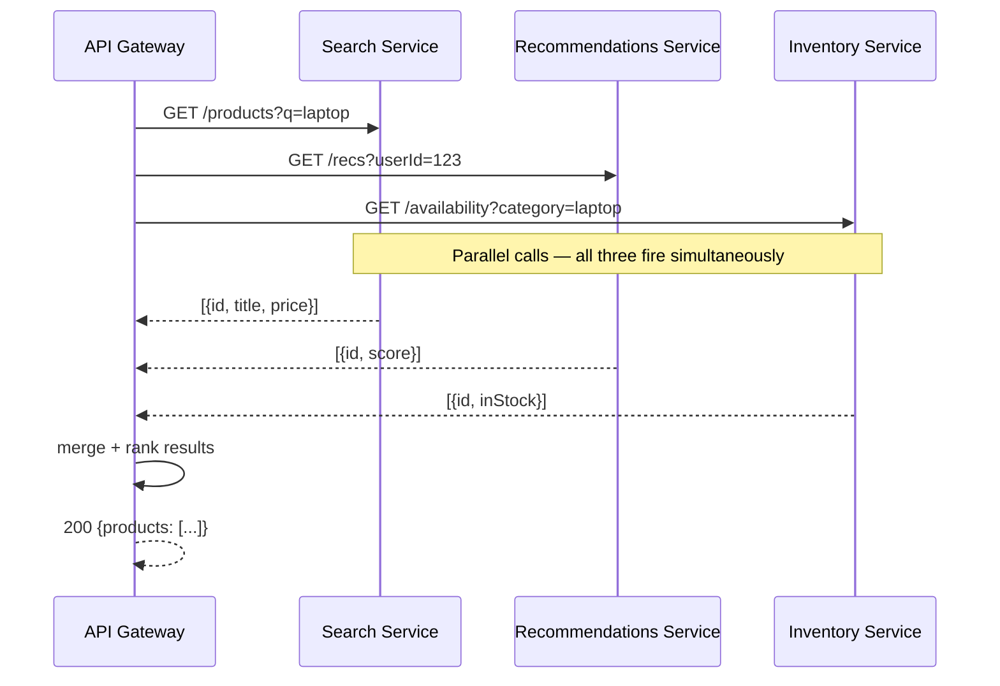
```mermaid
sequenceDiagram
  participant GW as API Gateway
  participant Search as Search Service
  participant Recs as Recommendations Service
  participant Inventory as Inventory Service

  GW->>Search: GET /products?q=laptop
  GW->>Recs: GET /recs?userId=123
  GW->>Inventory: GET /availability?category=laptop

  Note over Search,Inventory: Parallel calls — all three fire simultaneously

  Search-->>GW: [{id, title, price}]
  Recs-->>GW: [{id, score}]
  Inventory-->>GW: [{id, inStock}]

  GW->>GW: merge + rank results
  GW-->>GW: 200 {products: [...]}
```

For truly parallel calls, add a note to make the concurrency explicit — the diagram syntax alone does not enforce ordering.

---

### Async Flows: Webhooks and Callbacks

When a response comes back asynchronously (webhook, polling, event), show the two phases separately:

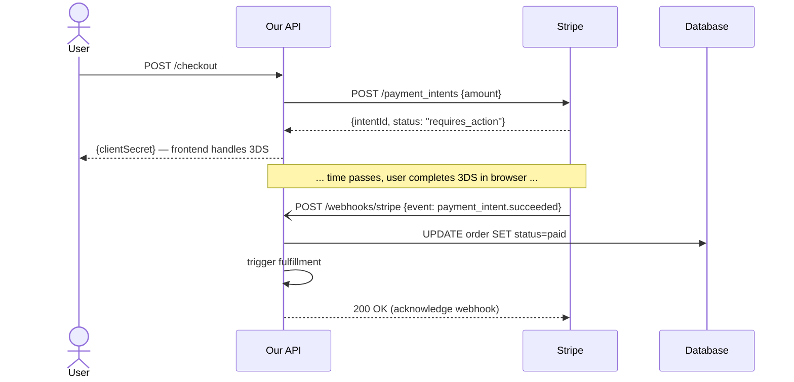
```mermaid
sequenceDiagram
  actor User
  participant API as Our API
  participant Pay as Stripe
  participant DB as Database

  User->>API: POST /checkout
  API->>Pay: POST /payment_intents {amount}
  Pay-->>API: {intentId, status: "requires_action"}
  API-->>User: {clientSecret} — frontend handles 3DS

  Note over Pay,API: ... time passes, user completes 3DS in browser ...

  Pay-)API: POST /webhooks/stripe {event: payment_intent.succeeded}
  API->>DB: UPDATE order SET status=paid
  API->>API: trigger fulfillment
  API-->>Pay: 200 OK (acknowledge webhook)
```

This pattern — synchronous initiation, asynchronous completion via webhook — is one of the most common sources of bugs in payment integrations. Documenting it explicitly prevents AI tools from generating code that assumes the payment is complete on the first response.

---

### Original Example: Backend Service Flow

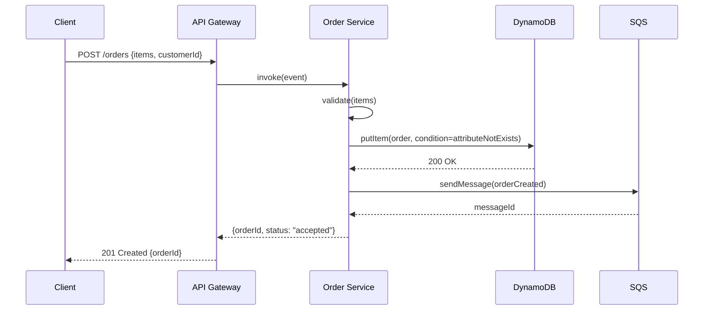
```mermaid
sequenceDiagram
  participant Client
  participant API as API Gateway
  participant Orders as Order Service
  participant DB as DynamoDB
  participant Queue as SQS

  Client->>API: POST /orders {items, customerId}
  API->>Orders: invoke(event)
  Orders->>Orders: validate(items)
  Orders->>DB: putItem(order, condition=attributeNotExists)
  DB-->>Orders: 200 OK
  Orders->>Queue: sendMessage(orderCreated)
  Queue-->>Orders: messageId
  Orders-->>API: {orderId, status: "accepted"}
  API-->>Client: 201 Created {orderId}
```

**What AI learns from this**: the exact call chain, the conditional DynamoDB write, the async queue pattern, and the response shape — all in one readable artifact.

---

### Sequence Diagram Best Practices for AI

- Use `participant` aliases that match your actual class/service/component names
- Label every arrow with the method, endpoint, or event being sent
- Show return arrows (`-->>`) for all synchronous responses; omit only for true fire-and-forget
- Include `actor User` (or `actor Browser`) as the starting participant for user-initiated flows
- Mark async calls with `-)` and add a `Note` explaining why there is no immediate response
- Include error paths as `alt`/`else` blocks for the most common failure modes:

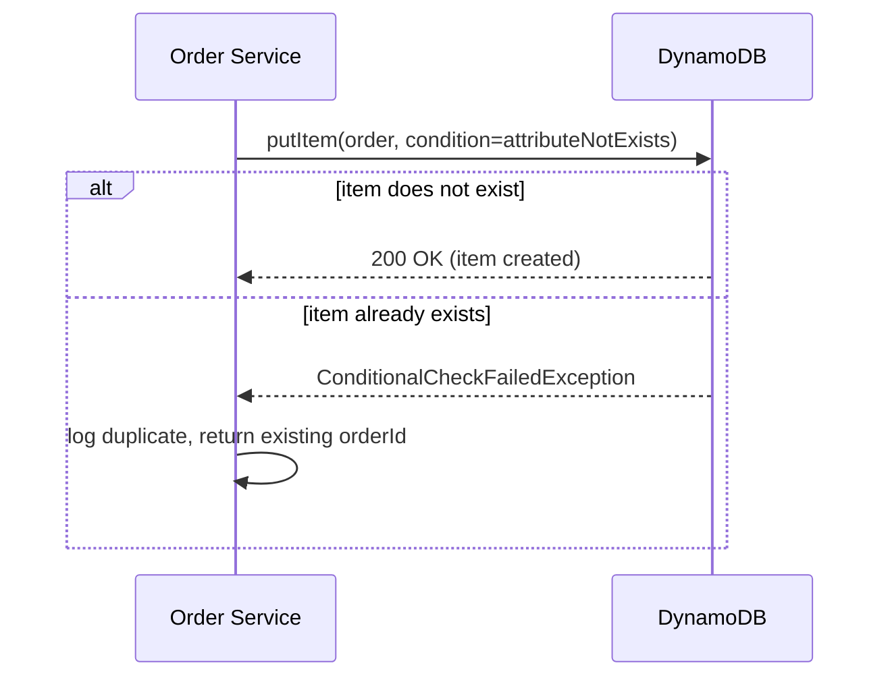
```mermaid
sequenceDiagram
  participant Orders as Order Service
  participant DB as DynamoDB

  Orders->>DB: putItem(order, condition=attributeNotExists)
  alt item does not exist
    DB-->>Orders: 200 OK (item created)
  else item already exists
    DB-->>Orders: ConditionalCheckFailedException
    Orders->>Orders: log duplicate, return existing orderId
  end
```

---

## Entity-Relationship Diagrams: Best for Data Models

ERDs show **what data exists, how it is structured, and how entities relate to each other**. They answer the question "how is the data organized?" and are critical for generating correct queries, migrations, and data access code.

Use an ERD when documenting:
- **Database schema** — tables, columns, types, primary and foreign keys
- **Data ownership** — which entity owns which data, cardinality rules
- **Join paths** — how to traverse from one entity to another
- **Constraints** — uniqueness, nullability, valid ranges

**Good for**: "How is the data organized?" and "What joins do I need?"

---

### Core ERD: One-to-Many Relationships

The most common pattern — a parent entity with child records.

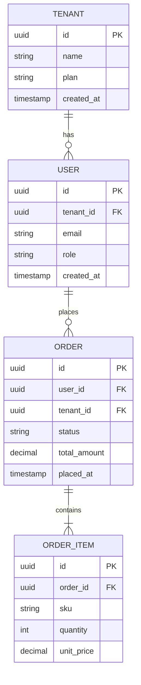
```mermaid
erDiagram
  TENANT {
    uuid id PK
    string name
    string plan
    timestamp created_at
  }

  USER {
    uuid id PK
    uuid tenant_id FK
    string email
    string role
    timestamp created_at
  }

  ORDER {
    uuid id PK
    uuid user_id FK
    uuid tenant_id FK
    string status
    decimal total_amount
    timestamp placed_at
  }

  ORDER_ITEM {
    uuid id PK
    uuid order_id FK
    string sku
    int quantity
    decimal unit_price
  }

  TENANT ||--o{ USER : "has"
  USER ||--o{ ORDER : "places"
  ORDER ||--|{ ORDER_ITEM : "contains"
```

**What AI learns from this**: the foreign key paths for JOINs (`USER.tenant_id → TENANT.id`), that an order always has at least one item (`||--|{` = one-to-one-or-more), and that a user may have zero orders (`||--o{` = one-to-zero-or-more).

---

### Mermaid ERD Cardinality Syntax

| Symbol | Meaning | Example |
|--------|---------|---------|
| `\|\|` | Exactly one | A user has exactly one profile |
| `o\|` | Zero or one | An order has zero or one coupon |
| `\|{` | One or more | An order has one or more items |
| `o{` | Zero or more | A user has zero or more orders |

Combine left and right sides to form a relationship:

| Syntax | Reads As | Common Name |
|--------|----------|-------------|
| `A \|\|--\|\| B` | A has exactly one B, B has exactly one A | One-to-one |
| `A \|\|--o{ B` | A has zero or more B, each B has exactly one A | One-to-many |
| `A \|\|--\|{ B` | A has one or more B, each B has exactly one A | One-to-many (required) |
| `A }o--o{ B` | A has zero or more B, B has zero or more A | Many-to-many |

---

### Many-to-Many with Junction Table

Many-to-many relationships require a junction (join/bridge) table. Always show the junction table explicitly — it's where the foreign keys live and often carries its own attributes.

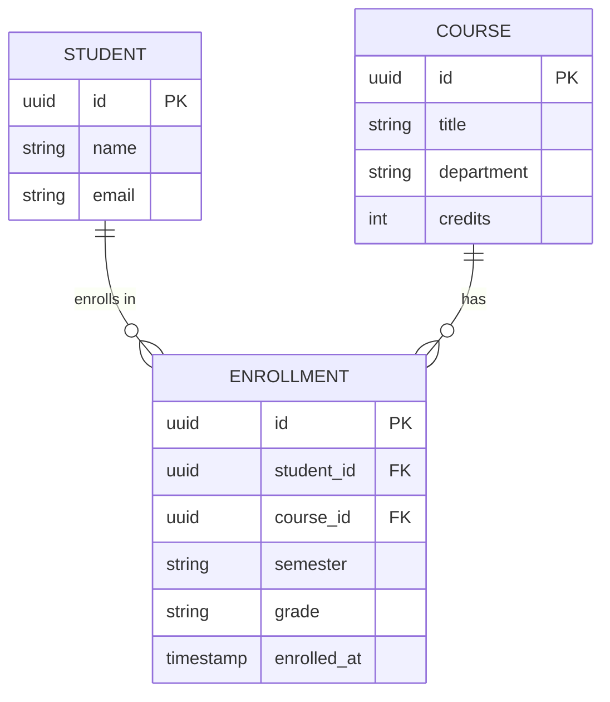
```mermaid
erDiagram
  STUDENT {
    uuid id PK
    string name
    string email
  }

  COURSE {
    uuid id PK
    string title
    string department
    int credits
  }

  ENROLLMENT {
    uuid id PK
    uuid student_id FK
    uuid course_id FK
    string semester
    string grade
    timestamp enrolled_at
  }

  STUDENT ||--o{ ENROLLMENT : "enrolls in"
  COURSE ||--o{ ENROLLMENT : "has"
```

**What AI learns from this**: to query "all courses for a student," join through `ENROLLMENT`. The junction table carries `semester` and `grade` — not just foreign keys.

Other common many-to-many patterns:
- **Tags**: `ARTICLE }o--o{ TAG` via `ARTICLE_TAG` junction
- **Permissions**: `USER }o--o{ ROLE` via `USER_ROLE`, then `ROLE }o--o{ PERMISSION` via `ROLE_PERMISSION`
- **Products/Categories**: `PRODUCT }o--o{ CATEGORY` via `PRODUCT_CATEGORY`

---

### Self-Referential Relationships

When an entity relates to itself — common for hierarchies, graphs, and organizational structures.

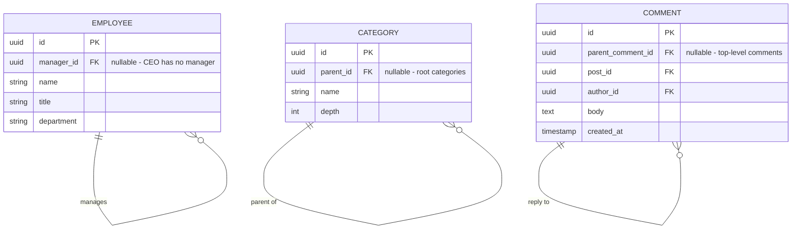
```mermaid
erDiagram
  EMPLOYEE {
    uuid id PK
    uuid manager_id FK "nullable - CEO has no manager"
    string name
    string title
    string department
  }

  CATEGORY {
    uuid id PK
    uuid parent_id FK "nullable - root categories"
    string name
    int depth
  }

  COMMENT {
    uuid id PK
    uuid parent_comment_id FK "nullable - top-level comments"
    uuid post_id FK
    uuid author_id FK
    text body
    timestamp created_at
  }

  EMPLOYEE ||--o{ EMPLOYEE : "manages"
  CATEGORY ||--o{ CATEGORY : "parent of"
  COMMENT ||--o{ COMMENT : "reply to"
```

**What AI learns from this**: the recursive foreign key pattern, that root nodes have `NULL` parent IDs, and the join to traverse the hierarchy (`EMPLOYEE e JOIN EMPLOYEE m ON e.manager_id = m.id`).

When documenting self-referential relationships, always note:
- Whether the hierarchy has a fixed depth (org chart) or unbounded depth (category tree, threaded comments)
- How root nodes are identified (`parent_id IS NULL`)
- Whether the codebase uses recursive queries (CTEs), materialized paths, or nested sets

---

### Polymorphic / Inheritance Patterns

When multiple entity types share a common structure. Document which pattern is used — this is a common source of confusion and bugs.

**Single Table Inheritance (STI)**: All types in one table with a discriminator column.

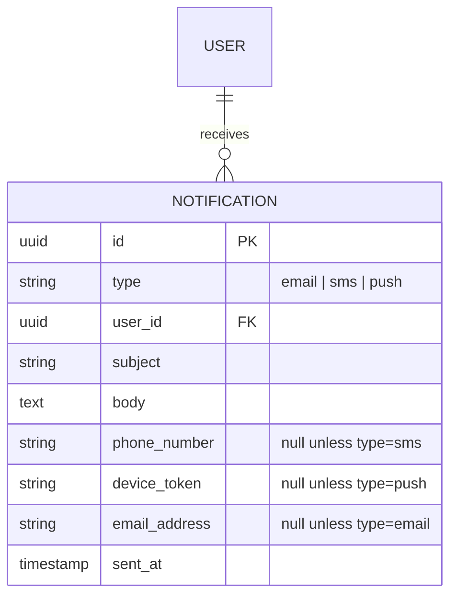
```mermaid
erDiagram
  NOTIFICATION {
    uuid id PK
    string type "email | sms | push"
    uuid user_id FK
    string subject
    text body
    string phone_number "null unless type=sms"
    string device_token "null unless type=push"
    string email_address "null unless type=email"
    timestamp sent_at
  }

  USER ||--o{ NOTIFICATION : "receives"
```

**Table-Per-Type (TPT)**: Shared columns in a base table, type-specific columns in child tables.

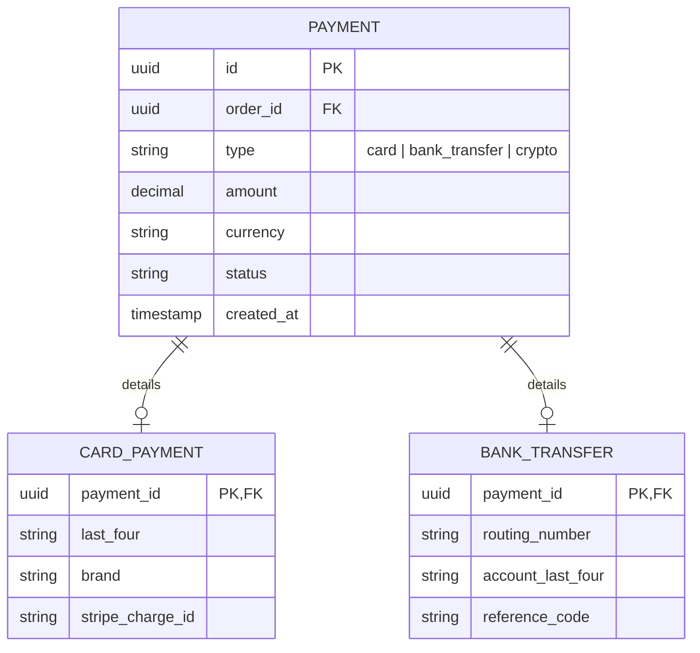
```mermaid
erDiagram
  PAYMENT {
    uuid id PK
    uuid order_id FK
    string type "card | bank_transfer | crypto"
    decimal amount
    string currency
    string status
    timestamp created_at
  }

  CARD_PAYMENT {
    uuid payment_id PK,FK
    string last_four
    string brand
    string stripe_charge_id
  }

  BANK_TRANSFER {
    uuid payment_id PK,FK
    string routing_number
    string account_last_four
    string reference_code
  }

  PAYMENT ||--o| CARD_PAYMENT : "details"
  PAYMENT ||--o| BANK_TRANSFER : "details"
```

**What AI learns from this**: with STI, query one table but filter by `type` and expect nullable type-specific columns. With TPT, always JOIN the base table to the type-specific table. Getting this wrong produces queries that silently return incomplete data.

---

### Documenting Constraints and Indexes

ERDs show structure, but constraints and indexes drive correctness and performance. Document these alongside the diagram:

```
Constraints and indexes for ORDER:
├── UNIQUE(tenant_id, order_number)     — order numbers unique per tenant
├── CHECK(total_amount >= 0)            — no negative totals
├── CHECK(status IN ('pending','paid','shipped','delivered','cancelled'))
├── INDEX(user_id)                      — lookup orders by user
├── INDEX(tenant_id, status)            — dashboard queries filter by tenant + status
└── INDEX(placed_at DESC)               — recent orders first
```

This matters for AI because:
- **Unique constraints** prevent duplicate inserts — AI should use upsert or check-before-insert
- **Check constraints** define valid values — AI should validate before writing
- **Indexes** indicate expected query patterns — AI should write queries that use them
- **Composite indexes** reveal multi-column filter patterns

---

### ERD in Code Comments (ASCII)

For model files where Mermaid won't render, embed a compact ASCII ERD:

```python
"""
Order data model.

Relationships:
  TENANT 1──* USER 1──* ORDER 1──+ ORDER_ITEM
                              |
                         0..1 COUPON

  * = zero or more, + = one or more, 1 = exactly one

Key constraints:
  - ORDER.order_number unique per tenant
  - ORDER_ITEM.quantity > 0
  - ORDER.status enum: pending → paid → shipped → delivered
"""
```

```typescript
/**
 * Payment model — Table-Per-Type inheritance.
 *
 * PAYMENT (base) ──┬── CARD_PAYMENT (type="card")
 *                  ├── BANK_TRANSFER (type="bank_transfer")
 *                  └── CRYPTO_PAYMENT (type="crypto")
 *
 * Always JOIN: SELECT p.*, cp.* FROM payment p
 *              JOIN card_payment cp ON cp.payment_id = p.id
 *              WHERE p.type = 'card'
 */
```

---

### ERD Best Practices for AI

1. **Use actual table and column names** — match the migration/schema exactly; `USER` not `Users` if the table is `USER`
2. **Mark PK and FK explicitly** — AI uses these to generate JOINs
3. **Include the type** for every column — `string`, `uuid`, `decimal`, `timestamp`, `int`, `boolean`, `text`
4. **Show nullable columns** — add a comment for columns that are conditionally null (polymorphic fields, optional relations)
5. **Document the cardinality** — the difference between "zero or more" and "one or more" prevents bugs in validation code
6. **Pair with a constraints block** — the diagram shows structure; the constraints block shows rules
7. **One bounded context per diagram** — a 50-table ERD is unreadable; split by domain (orders, users, payments)

---

## ASCII / Text Art: No-Dependency Option

For CLAUDE.md, code comments, and ADRs where Mermaid may not render, ASCII diagrams are universally readable by all AI tools. They are always parseable as text.

```
Data Flow:

Client
  │ HTTPS POST /orders
  ▼
API Gateway ──── validates auth ──▶ 401 if invalid
  │
  │ Lambda invoke
  ▼
Order Service
  │                     │
  │ DynamoDB PutItem    │ SQS SendMessage
  ▼                     ▼
Orders Table       Order Queue
                        │
                        │ Lambda trigger
                        ▼
                   Payment Service
```

### ASCII Best Practices for AI

- Label every arrow with the operation being performed
- Use consistent arrow styles (`──▶`, `│`, `▼`) within a diagram
- Add a one-line title or caption above the diagram
- Keep diagrams narrow enough to read without horizontal scrolling (≤80 chars)
- Use box-drawing characters (`┌─┐│└─┘`) for component boxes:

```
┌──────────────┐     ┌──────────────┐     ┌──────────────┐
│  Web Client  │────▶│ API Gateway  │────▶│Order Service │
└──────────────┘     └──────────────┘     └──────┬───────┘
                                                  │
                                         ┌────────▼───────┐
                                         │   DynamoDB     │
                                         └────────────────┘
```

---

## Control Flow Diagrams: Best for Logic, Branching, and Process Steps

Control flow diagrams answer **"what happens, in what order, and under what conditions?"** They show the step-by-step logic of a function, algorithm, or business process — including branches, loops, and error paths. This is distinct from sequence diagrams (which show *who* calls *whom*) and state machines (which show *what state* an object is in).

Use a control flow diagram when you want to document:
- Branching logic (if/else, switch)
- Loops and retries
- Error and exception paths
- Business rules with multiple conditions
- The internal logic of a non-obvious function

**Good for**: "What does this function or process do step by step?"

### Types of Control Flow Diagrams

| Type | Best For | Format |
|------|---------|--------|
| Flowchart | General branching and sequencing | Mermaid `flowchart` |
| Decision tree | Multi-condition branching with clear outcomes | Mermaid `flowchart` or ASCII |
| Activity diagram | Processes with loops, parallel paths, and swim lanes | Mermaid `flowchart` with subgraphs |

---

### Flowchart: Branching Logic

Use when a function has conditional paths that affect what happens next.

```mermaid
flowchart TD
    A([Start: processOrder]) --> B{Order exists?}
    B -- No --> C[Return 404 Not Found]
    B -- Yes --> D{Payment status?}
    D -- pending --> E[Authorize payment]
    E --> F{Authorization OK?}
    F -- No --> G[Set status = payment_failed]
    G --> H[Emit PaymentFailed event]
    H --> Z([End])
    F -- Yes --> I[Set status = authorized]
    D -- already_authorized --> I
    I --> J[Enqueue for fulfillment]
    J --> K[Return 200 OK]
    K --> Z
    C --> Z
```

**What AI learns from this**: the exact decision points, all branches including failures, the event emitted on failure, and the happy path — without reading the implementation.

#### Mermaid Flowchart Syntax Cheatsheet

| Element | Syntax | Renders As |
|---------|--------|-----------|
| Start/end | `([label])` | Rounded pill |
| Process step | `[label]` | Rectangle |
| Decision | `{label?}` | Diamond |
| Arrow with label | `-- label -->` | Labeled edge |
| Yes/No branches | `-- Yes -->` / `-- No -->` | Labeled branches |

---

### Decision Tree: Multi-Condition Branching

Use when the logic is a series of conditions with distinct leaf outcomes — common for validation, routing, and classification logic.

```mermaid
flowchart TD
    A{Is user authenticated?} -- No --> B[Return 401]
    A -- Yes --> C{Has required role?}
    C -- No --> D[Return 403]
    C -- Yes --> E{Is resource owned by user?}
    E -- No --> F{Is user an admin?}
    F -- No --> G[Return 403]
    F -- Yes --> H[Allow access]
    E -- Yes --> H
```

Decision trees can also be written as **ASCII text** for use in CLAUDE.md, code comments, and ADRs where Mermaid may not render:

```
Authorize request:
├── authenticated? No  → 401 Unauthorized
└── authenticated? Yes
    ├── has role? No   → 403 Forbidden
    └── has role? Yes
        ├── owns resource? Yes         → allow
        └── owns resource? No
            ├── is admin? Yes          → allow
            └── is admin? No           → 403 Forbidden
```

ASCII decision trees are the most AI-readable form of branching logic — they are plain text, require no rendering, and map directly onto if/else and switch structures in code.

---

### Activity Diagram: Loops and Retry Logic

Use when a process has loops, retries, or parallel steps. Mermaid flowcharts approximate activity diagrams using back-edges and subgraphs.

```mermaid
flowchart TD
    A([Start: syncWithUpstream]) --> B[Fetch batch of 100 records]
    B --> C{Records returned?}
    C -- No --> Z([End: sync complete])
    C -- Yes --> D[Process each record]
    D --> E{Processing error?}
    E -- Yes --> F{Retry count < 3?}
    F -- Yes --> G[Increment retry, wait backoff]
    G --> D
    F -- No --> H[Log failure, move to dead-letter]
    H --> I[Continue to next record]
    E -- No --> I
    I --> J{More records in batch?}
    J -- Yes --> D
    J -- No --> B
```

Key patterns to show in activity diagrams:
- **Retry loops**: back-edge from error handler to the step being retried
- **Batch iteration**: loop back to fetch after completing a batch
- **Dead-letter / skip**: explicit path for unrecoverable failures that keeps the process moving

---

### Error Path Documentation

Error paths are the most commonly omitted part of control flow diagrams. For AI-readable documentation, always include:

1. The **happy path** (all conditions satisfied)
2. **Validation failures** (bad input, missing required fields)
3. **Downstream failures** (external service errors, timeouts)
4. **Conflict/race conditions** (duplicate, stale state)

```mermaid
flowchart TD
    A([createUser]) --> B{Email valid format?}
    B -- No --> C[Return 400: invalid email]
    B -- Yes --> D{Email already exists?}
    D -- Yes --> E[Return 409: email taken]
    D -- No --> F[Hash password]
    F --> G[Write to DB]
    G --> H{DB write OK?}
    H -- No --> I[Log error, return 500]
    H -- Yes --> J[Send welcome email async]
    J --> K[Return 201 Created]
    C --> Z([End])
    E --> Z
    I --> Z
    K --> Z
```

---

### Control Flow in Code Comments (ASCII)

For functions where the logic is non-obvious, embed a mini control flow diagram directly in the source as a block comment:

```typescript
/**
 * Resolves the effective price for a line item.
 *
 * Logic:
 *   hasCustomerDiscount? Yes → apply discount to base price
 *                        No  → use base price
 *       └── price < minimumMargin?
 *             Yes → use minimumMargin (floor enforcement)
 *             No  → use computed price
 */
function resolvePrice(item: LineItem, customer: Customer): number { ... }
```

AI tools read docblock comments and will follow this logic when generating code that calls or modifies the function.

---

## State Diagrams: Best for Object Lifecycle

State diagrams show **how something changes state over time** — what states are possible, which transitions between them are valid, and what triggers each transition. They answer the question "what states can this object be in?"

Use a state diagram when documenting:
- **Lifecycle rules** — the full set of states an object can be in
- **Valid transitions** — which state changes are allowed (and implicitly, which are not)
- **Edge cases** — error states, retry states, cancellation paths, terminal states

**Good for**: "What states can this object be in?" and "Can I transition from X to Y?"

---

### Order Lifecycle

```mermaid
stateDiagram-v2
  [*] --> Pending : order placed

  Pending --> PaymentAuthorized : payment succeeds
  Pending --> PaymentFailed : payment fails
  Pending --> Cancelled : customer cancels

  PaymentAuthorized --> Fulfilling : warehouse picks
  PaymentAuthorized --> Cancelled : customer cancels (before fulfillment)

  Fulfilling --> Shipped : carrier picked up
  Fulfilling --> Cancelled : item out of stock

  Shipped --> Delivered : carrier confirms delivery
  Shipped --> ReturnRequested : customer initiates return

  PaymentFailed --> [*]
  Cancelled --> [*]
  Delivered --> [*]
  ReturnRequested --> ReturnProcessed : return received
  ReturnProcessed --> [*]
```

**What AI learns**: valid status values, which transitions are allowed, and implicitly which transitions are NOT valid (e.g., `Shipped → Pending` is not in the diagram → don't generate that code).

---

### Job / Queue Lifecycle

Background jobs and task queues have their own lifecycle with retry and failure states that are easy to get wrong in code. The diagram makes the retry loop and terminal states explicit:

```mermaid
stateDiagram-v2
  [*] --> Queued : job enqueued

  Queued --> Running : worker picks up

  Running --> Complete : execution succeeds
  Running --> Failed : execution throws / timeout

  Failed --> Retrying : attempt < maxAttempts
  Failed --> DeadLetter : attempt >= maxAttempts

  Retrying --> Running : backoff elapsed, re-enqueued
  Retrying --> Cancelled : operator cancels

  Queued --> Cancelled : operator cancels before pickup

  Complete --> [*]
  DeadLetter --> [*]
  Cancelled --> [*]
```

**What AI learns**: the retry loop (`Failed → Retrying → Running`), the dead-letter terminal state, the cancellation paths from both `Queued` and `Retrying`, and that `Complete`, `DeadLetter`, and `Cancelled` are all terminal — no further transitions are valid.

---

### State + Transition Table (Companion to Diagram)

For objects with many states, pair the diagram with a transition table. The table answers "given current state S, what events are valid and what state results?":

| Current State | Event / Trigger | Next State | Guard Condition |
|--------------|----------------|------------|----------------|
| `Pending` | payment_succeeded | `PaymentAuthorized` | — |
| `Pending` | payment_failed | `PaymentFailed` | — |
| `Pending` | cancel_requested | `Cancelled` | — |
| `PaymentAuthorized` | fulfillment_started | `Fulfilling` | inventory reserved |
| `PaymentAuthorized` | cancel_requested | `Cancelled` | before fulfillment |
| `Fulfilling` | carrier_pickup | `Shipped` | — |
| `Fulfilling` | out_of_stock | `Cancelled` | — |
| `Shipped` | delivery_confirmed | `Delivered` | — |
| `Shipped` | return_initiated | `ReturnRequested` | within return window |

The **Guard Condition** column captures business rules that are otherwise hidden in application code — this is high-value context for AI tools generating validation or transition logic.

---

### Documenting Invalid Transitions

A diagram shows what IS valid. For critical business objects, also document what is explicitly NOT allowed — this prevents AI from generating code that bypasses the state machine:

```
Invalid transitions for Order:
- Delivered → any state (terminal — no re-opening)
- Shipped → Pending / PaymentAuthorized (cannot revert once shipped)
- Cancelled → any state (terminal — create a new order instead)
- Fulfilling → PaymentFailed (payment was already authorized)
```

---

### States in Code: Enum + Transition Guard Pattern

When generating or modifying state transition code, AI tools benefit from seeing the canonical enum values alongside the diagram:

```typescript
// Valid states — matches the state diagram in docs/ARCHITECTURE.md
type OrderStatus =
  | "pending"
  | "payment_authorized"
  | "payment_failed"
  | "fulfilling"
  | "shipped"
  | "delivered"
  | "cancelled"
  | "return_requested"
  | "return_processed"

// Transition guard — throws if transition is not in the diagram
function transition(order: Order, to: OrderStatus): Order {
  const valid = VALID_TRANSITIONS[order.status]
  if (!valid?.includes(to)) {
    throw new InvalidTransitionError(order.status, to)
  }
  return { ...order, status: to }
}
```

The comment linking to the diagram ties the code to the authoritative source of truth.

---

### State Diagrams in Code Comments

For domain objects, embed a compact ASCII state diagram directly in the class or type definition:

```typescript
/**
 * Job status lifecycle:
 *
 *   queued → running → complete
 *                   ↓
 *                failed → retrying → running (loop)
 *                       ↓
 *                   dead_letter  (maxAttempts reached)
 *
 * Terminal states: complete, dead_letter, cancelled
 * cancelled can be reached from: queued, retrying
 */
type JobStatus = "queued" | "running" | "complete" | "failed" | "retrying" | "dead_letter" | "cancelled"
```

---

## Decision Tables: Best for Business Rules and Condition Logic

Decision tables show **what exact rules drive behavior** by laying out every combination of conditions and their outcomes in a structured grid. They extract logic that is otherwise buried in nested if/else chains, switch statements, or scattered across multiple files, and make it reviewable at a glance.

Use a decision table when documenting:
- **Complicated condition logic** — multiple variables interact to determine an outcome
- **Policy-driven code** — pricing tiers, permissions, eligibility, risk scoring
- **Validation rules** — what combinations of inputs are valid/invalid and why
- **Configuration-driven behavior** — feature flags, A/B tests, environment-specific logic

**Good for**: "What exact rules drive this behavior?"

---

### Basic Decision Table

A decision table has condition rows (inputs), action rows (outputs), and one column per rule. Read each column top-to-bottom as one complete rule.

```markdown
## Pricing Rules: Shipping Fee Calculation

| Condition | Rule 1 | Rule 2 | Rule 3 | Rule 4 | Rule 5 |
|-----------|--------|--------|--------|--------|--------|
| Customer tier | Standard | Standard | Premium | Premium | Any |
| Order total | < $50 | ≥ $50 | < $25 | ≥ $25 | — |
| Item type | — | — | — | — | Oversized |
| **Shipping fee** | **$7.99** | **Free** | **$3.99** | **Free** | **$14.99** |

Rules are evaluated left-to-right; first match wins.
Rule 5 overrides all others (oversized items always incur a flat fee).
```

**What AI learns from this**: every pricing path, the priority order, and the override rule — without reading the implementation. AI can generate the correct `calculateShippingFee()` function from this table alone.

---

### Condition-Action Table (Horizontal Layout)

When there are many conditions but few rules, a horizontal layout is clearer — one row per rule:

```markdown
## Refund Eligibility Rules

| # | Customer Type | Days Since Purchase | Item Condition | Refund Amount | Approval Required |
|---|--------------|-------------------|---------------|--------------|------------------|
| 1 | Any | ≤ 14 | Unopened | 100% | No |
| 2 | Any | ≤ 14 | Opened, undamaged | 100% | No |
| 3 | Any | ≤ 14 | Damaged by customer | 50% | Manager |
| 4 | Premium | 15–90 | Any | 100% | No |
| 5 | Standard | 15–30 | Unopened | 100% | Manager |
| 6 | Standard | 15–30 | Opened | 75% | Manager |
| 7 | Standard | 31–90 | Any | Store credit only | Director |
| 8 | Any | > 90 | Any | No refund | — |

Source: `services/refunds/eligibility.ts:calculateRefund()`
```

**What AI learns from this**: the exact refund percentage for every scenario, who needs to approve, and that Premium customers get better terms. When generating or modifying refund logic, AI follows this table rather than guessing.

---

### Multi-Outcome Decision Table

When the same conditions determine multiple independent outcomes, add multiple action rows:

```markdown
## Account Risk Assessment

| Condition | Rule 1 | Rule 2 | Rule 3 | Rule 4 | Rule 5 |
|-----------|--------|--------|--------|--------|--------|
| Risk score | 0–30 | 31–60 | 61–80 | 81–95 | 96–100 |
| Account age | Any | Any | Any | Any | Any |
| Recent chargebacks | 0 | 0–1 | 0–2 | Any | Any |
| **Actions:** | | | | | |
| Transaction limit | $10,000 | $5,000 | $1,000 | $100 | $0 (blocked) |
| Review required | No | No | Automated | Manual | Manual |
| Additional auth | None | None | 2FA prompt | 2FA + ID verify | Account frozen |
| Alert | None | None | Slack #risk | Slack + email | PagerDuty |

Source: `services/risk/assessment.ts` + `config/risk-thresholds.yml`
```

---

### Validation Rules Matrix

For input validation that spans multiple fields, document which combinations are valid:

```markdown
## Order Validation Rules

| Field | Rule | Error Code | Error Message |
|-------|------|-----------|---------------|
| `items` | Must be non-empty array | `ORDER_NO_ITEMS` | "Order must contain at least one item" |
| `items[].quantity` | Must be integer > 0 | `INVALID_QUANTITY` | "Quantity must be a positive integer" |
| `items[].sku` | Must exist in product catalog | `UNKNOWN_SKU` | "Product {sku} not found" |
| `shipping_address` | Required if `delivery_method` = "ship" | `MISSING_ADDRESS` | "Shipping address required for delivery" |
| `shipping_address.zip` | Must match `^\d{5}(-\d{4})?$` (US) | `INVALID_ZIP` | "Invalid ZIP code format" |
| `coupon_code` | If present, must be active and not expired | `INVALID_COUPON` | "Coupon {code} is expired or invalid" |
| `total` | Must equal sum of (item.qty × item.price) - discount | `TOTAL_MISMATCH` | "Calculated total does not match" |

Cross-field rules:
- If `delivery_method` = "pickup", `shipping_address` must be absent (return `INVALID_PICKUP` if present)
- If any item is `hazardous`, `shipping_method` cannot be "air" (return `HAZMAT_AIR_PROHIBITED`)
- Maximum 50 items per order (return `ORDER_TOO_LARGE`)

Source: `validators/order.ts:validateOrder()`
```

**What AI learns from this**: every validation check, the exact error code and message for each, and the cross-field rules that are hardest to discover by reading code. AI can generate or update the validator to match this spec exactly.

---

### Permission / Authorization Matrix

A special case of decision table where the conditions are role × resource × action:

```markdown
## Authorization Rules

| Resource | Action | Anonymous | Customer | Support | Admin |
|----------|--------|-----------|----------|---------|-------|
| Products | View | ✓ | ✓ | ✓ | ✓ |
| Products | Create/Edit | ✗ | ✗ | ✗ | ✓ |
| Orders | Create | ✗ | ✓ (own) | ✗ | ✓ |
| Orders | View | ✗ | ✓ (own) | ✓ (any) | ✓ (any) |
| Orders | Cancel | ✗ | ✓ (own, before ship) | ✓ (any, before ship) | ✓ (any) |
| Orders | Refund | ✗ | ✗ | ✓ (≤ $100) | ✓ (any) |
| Users | View profile | ✗ | ✓ (own) | ✓ (any) | ✓ (any) |
| Users | Edit profile | ✗ | ✓ (own) | ✗ | ✓ (any) |
| Users | Delete | ✗ | ✗ | ✗ | ✓ |
| Reports | View | ✗ | ✗ | ✓ | ✓ |

Legend: ✓ = allowed, ✗ = denied, (own) = only their own records
Conditions in parentheses are guard clauses enforced in code.

Source: `middleware/authorize.ts` + `config/permissions.yml`
```

**What AI learns from this**: the complete authorization model in one scannable table. When adding a new endpoint, AI can look up what roles should have access and what guard clauses to apply, matching the established pattern.

---

### Feature Flag / Toggle Matrix

When behavior varies by feature flag, environment, or A/B test:

```markdown
## Feature Flags

| Flag | Dev | Staging | Prod | Prod (% rollout) | Behavior When On |
|------|-----|---------|------|------------------|-----------------|
| `new_checkout_flow` | On | On | On | 25% | Use redesigned checkout UI |
| `ai_recommendations` | On | On | Off | — | Show AI product recommendations |
| `stripe_v2_api` | On | On | On | 100% | Use Stripe API v2 (idempotency keys) |
| `order_limit_increase` | On | Off | Off | — | Raise max items per order from 50 to 200 |
| `dark_mode` | On | On | On | 50% (user-id hash) | Enable dark mode toggle |

Source: `config/feature-flags.ts` + LaunchDarkly dashboard
```

---

### Extracting Decision Tables from Code

When reverse-engineering business rules from an existing codebase, look for these patterns:

| Code Pattern | Likely Decision Table |
|-------------|----------------------|
| Nested if/else or switch with >3 branches | Condition-action table |
| Policy classes or strategy pattern | Multi-outcome decision table |
| Validation middleware with multiple checks | Validation rules matrix |
| Role-based `canAccess()` / `authorize()` | Permission matrix |
| Pricing/discount calculation functions | Pricing rules table |
| Configuration files with environment overrides | Feature flag matrix |
| Risk scoring or classification functions | Risk assessment table |

**Process**:
1. Identify the function that contains the branching logic
2. List all input variables (conditions)
3. List all possible outcomes (actions)
4. Enumerate every combination that the code handles
5. Verify against tests — test cases often document edge cases the code handles implicitly
6. Include the source file path so the table stays linked to the code

---

### Decision Tables in Code Comments

Embed compact decision tables directly in the source for functions with complex branching:

```python
def calculate_shipping_fee(order: Order, customer: Customer) -> Decimal:
    """
    Shipping fee rules:

    | Customer  | Total  | Item Type  | Fee    |
    |-----------|--------|------------|--------|
    | Standard  | < $50  | Normal     | $7.99  |
    | Standard  | ≥ $50  | Normal     | Free   |
    | Premium   | < $25  | Normal     | $3.99  |
    | Premium   | ≥ $25  | Normal     | Free   |
    | Any       | Any    | Oversized  | $14.99 |

    Oversized check takes priority (evaluated first).
    """
    ...
```

```typescript
/**
 * Refund eligibility — see docs/business-rules.md for full table.
 *
 * Quick reference:
 *   ≤14 days + unopened       → 100%, auto-approved
 *   ≤14 days + opened         → 100%, auto-approved
 *   ≤14 days + damaged        → 50%, manager approval
 *   Premium + 15–90 days      → 100%, auto-approved
 *   Standard + 15–30 + sealed → 100%, manager approval
 *   >90 days                  → no refund
 */
function calculateRefund(order: Order, customer: Customer): RefundResult { ... }
```

---

### Decision Table Best Practices for AI

1. **Include every branch** — if the code has 8 paths, the table has 8 columns/rows; missing rules = missing documentation for edge cases
2. **Mark the priority order** — "first match wins" vs "most specific wins" vs "all matching rules apply"; this is the #1 source of bugs in rule-driven code
3. **Link to source code** — include the file path and function name so the table stays connected to the implementation
4. **Include error codes and messages** — for validation rules, the exact error code is what API consumers see; AI needs this to generate correct error handling
5. **Use "Any" and "—" explicitly** — distinguish "any value is valid" from "this condition doesn't apply to this rule"
6. **Document override rules** — when one rule trumps another (e.g., oversized items override tier-based pricing), state it explicitly
7. **Verify against tests** — test cases often cover edge cases that aren't obvious from reading the production code; cross-reference

---

## Event Analysis: Best for Domain Behavior and Async Systems

Event analysis documents **what meaningful things happen in a system** — the domain events, commands that trigger them, policies that react to them, and the flow of events through time. This is distinct from sequence diagrams (which show request/response between components) and state diagrams (which show one object's lifecycle). Event analysis shows the **business-level narrative**: what happened, why, and what happened next as a consequence.

Use event analysis when documenting:
- **Domain behavior** — what business-significant events the system produces
- **Asynchronous systems** — event-driven architectures, message queues, pub/sub
- **Cause-and-effect chains** — one event triggers a policy which issues a command which produces another event
- **System integration via events** — how services communicate without direct coupling

**Good for**: "What meaningful things happen in this system?"

---

### Event Catalog

The most practical starting point — a structured inventory of every domain event in the system, with its schema, producer, and consumers.

```markdown
## Event Catalog: Order Domain

| Event | Producer | Topic/Queue | Consumers | Payload (key fields) |
|-------|----------|-------------|-----------|---------------------|
| `OrderPlaced` | Order Service | `orders.events` | Payment Service, Analytics | `orderId, customerId, items[], totalAmount, currency` |
| `PaymentAuthorized` | Payment Service | `payments.events` | Order Service, Notification Service | `orderId, paymentId, amount, method` |
| `PaymentFailed` | Payment Service | `payments.events` | Order Service, Notification Service | `orderId, paymentId, reason, retryable` |
| `OrderConfirmed` | Order Service | `orders.events` | Warehouse Service, Notification Service, Analytics | `orderId, items[], shippingAddress` |
| `ShipmentCreated` | Warehouse Service | `shipping.events` | Order Service, Notification Service | `orderId, shipmentId, carrier, trackingNumber` |
| `OrderDelivered` | Shipping Tracker | `shipping.events` | Order Service, Notification Service, Analytics | `orderId, shipmentId, deliveredAt` |
| `RefundIssued` | Payment Service | `payments.events` | Order Service, Notification Service, Accounting | `orderId, refundId, amount, reason` |
| `OrderCancelled` | Order Service | `orders.events` | Payment Service, Warehouse Service, Analytics | `orderId, reason, cancelledBy` |
```

**What AI learns from this**: every event in the domain, who produces it, who consumes it, and what data it carries. When adding a new consumer or modifying an event payload, AI can check this catalog to understand the blast radius.

---

### Event Flow Timeline

Shows events in chronological order for a single business process — the "story" of what happens. Similar to a sequence diagram but focused on events rather than request/response calls.

```mermaid
flowchart LR
  subgraph "Happy Path: Order Lifecycle"
    e1([OrderPlaced]):::event --> c1[Authorize Payment]:::command
    c1 --> e2([PaymentAuthorized]):::event
    e2 --> c2[Confirm Order]:::command
    c2 --> e3([OrderConfirmed]):::event
    e3 --> c3[Reserve Inventory]:::command
    c3 --> e4([InventoryReserved]):::event
    e4 --> c4[Create Shipment]:::command
    c4 --> e5([ShipmentCreated]):::event
    e5 --> c5[Send Tracking Email]:::command
    e5 --> e6([OrderDelivered]):::event
  end

  classDef event fill:#ff9,stroke:#333
  classDef command fill:#9cf,stroke:#333
```

Use orange/yellow for events (things that happened) and blue for commands (actions taken in response). This convention comes from Event Storming workshops.

---

### Command-Event-Policy Chain

The core Event Storming pattern: **Commands** cause **Events**, **Policies** react to events by issuing new commands. This chain reveals the full cause-and-effect flow through the system.

```markdown
## Order Fulfillment: Command → Event → Policy Chain

| Step | Type | Name | Triggered By | Produces | Handler |
|------|------|------|-------------|----------|---------|
| 1 | Command | `PlaceOrder` | Customer (API) | `OrderPlaced` | `OrderService.placeOrder()` |
| 2 | Policy | On `OrderPlaced` | Event subscription | `AuthorizePayment` command | `PaymentPolicy.onOrderPlaced()` |
| 3 | Command | `AuthorizePayment` | Payment Policy | `PaymentAuthorized` or `PaymentFailed` | `PaymentService.authorize()` |
| 4a | Policy | On `PaymentAuthorized` | Event subscription | `ConfirmOrder` command | `OrderPolicy.onPaymentAuthorized()` |
| 4b | Policy | On `PaymentFailed` | Event subscription | `NotifyCustomer` command | `NotificationPolicy.onPaymentFailed()` |
| 5 | Command | `ConfirmOrder` | Order Policy | `OrderConfirmed` | `OrderService.confirm()` |
| 6 | Policy | On `OrderConfirmed` | Event subscription | `ReserveInventory` + `SendConfirmationEmail` | Multiple subscribers |
| 7 | Command | `ReserveInventory` | Warehouse Policy | `InventoryReserved` or `OutOfStock` | `WarehouseService.reserve()` |
```

**What AI learns from this**: the complete chain of causation — event A triggers policy B which issues command C which produces event D. This is the single most valuable documentation for understanding event-driven systems, because the code for each step is often in a different service or file.

---

### Event Schema Documentation

For each event, document the full payload schema. This is the contract between producer and consumers.

```markdown
## Event: OrderPlaced

**Version**: 2 (added `currency` field in v2, 2025-01-15)
**Topic**: `orders.events`
**Producer**: Order Service (`services/orders/events.ts:emitOrderPlaced()`)
**Consumers**: Payment Service, Analytics, Notification Service

### Schema

| Field | Type | Required | Description |
|-------|------|----------|-------------|
| `eventId` | UUID | Yes | Unique event identifier (idempotency key) |
| `eventType` | string | Yes | Always `"OrderPlaced"` |
| `timestamp` | ISO 8601 | Yes | When the event occurred |
| `orderId` | UUID | Yes | The order that was placed |
| `customerId` | UUID | Yes | Who placed the order |
| `items` | array | Yes | List of `{ sku, quantity, unitPrice }` |
| `totalAmount` | decimal | Yes | Order total before tax |
| `currency` | string | Yes | ISO 4217 currency code (v2+) |
| `shippingAddress` | object | Yes | `{ street, city, state, zip, country }` |
| `metadata` | object | No | Arbitrary key-value pairs |

### Guarantees
- **Ordering**: Events for the same `orderId` are ordered within the partition
- **Delivery**: At-least-once; consumers must be idempotent on `eventId`
- **Retention**: 7 days on Kafka; 30 days in event archive (S3)

### Example
```json
{
  "eventId": "evt-abc-123",
  "eventType": "OrderPlaced",
  "timestamp": "2025-03-15T14:30:00Z",
  "orderId": "ord-456",
  "customerId": "cust-789",
  "items": [
    { "sku": "WIDGET-A", "quantity": 2, "unitPrice": 29.99 }
  ],
  "totalAmount": 59.98,
  "currency": "USD",
  "shippingAddress": {
    "street": "123 Main St",
    "city": "Springfield",
    "state": "IL",
    "zip": "62704",
    "country": "US"
  }
}
```
```

---

### Producer-Consumer Map

Shows which services produce and consume which events — the "wiring diagram" of an event-driven system:

```mermaid
flowchart LR
  subgraph Producers
    orders[Order Service]
    payments[Payment Service]
    warehouse[Warehouse Service]
    shipping[Shipping Tracker]
  end

  subgraph "Event Bus (Kafka)"
    oe([orders.events]):::topic
    pe([payments.events]):::topic
    se([shipping.events]):::topic
  end

  subgraph Consumers
    pay_svc[Payment Service]
    notif[Notification Service]
    analytics[Analytics Pipeline]
    wh_svc[Warehouse Service]
    order_svc[Order Service]
  end

  orders --> oe
  payments --> pe
  warehouse --> se
  shipping --> se

  oe --> pay_svc
  oe --> notif
  oe --> analytics
  oe --> wh_svc
  pe --> order_svc
  pe --> notif
  pe --> analytics
  se --> order_svc
  se --> notif

  classDef topic fill:#f96,stroke:#333
```

**What AI learns from this**: which services are coupled through events (even though they don't call each other directly), which topics exist, and which service needs to handle which events. When adding a new event consumer, AI can see the existing pattern and follow it.

---

### Saga / Orchestration Flow

For multi-step business processes that span services, document the saga — the sequence of events and compensating actions if a step fails:

```markdown
## Saga: Order Fulfillment

| Step | Service | Action | Success Event | Failure Event | Compensation |
|------|---------|--------|--------------|--------------|--------------|
| 1 | Order | Create order (pending) | `OrderPlaced` | — | — |
| 2 | Payment | Authorize payment | `PaymentAuthorized` | `PaymentFailed` | Cancel order |
| 3 | Order | Confirm order | `OrderConfirmed` | — | Void payment |
| 4 | Warehouse | Reserve inventory | `InventoryReserved` | `OutOfStock` | Void payment, cancel order |
| 5 | Shipping | Create shipment | `ShipmentCreated` | `ShipmentFailed` | Release inventory, void payment, cancel order |

Compensation rules:
- Each step's failure triggers compensation for ALL preceding successful steps
- Compensations execute in reverse order (step 4 failure → undo step 3 → undo step 2)
- Compensations are idempotent — safe to retry
- Saga state tracked in: `services/orders/saga.ts` + `order_saga_state` DB table
```

**What AI learns from this**: the happy path, every failure point, and the exact compensation chain for each. This prevents AI from generating code that assumes success without handling the rollback path.

---

### Reverse-Engineering Events from Code

When analyzing an existing codebase to build an event catalog, look for:

| Source | What It Reveals |
|--------|----------------|
| Event class/type definitions | `class OrderPlaced`, `type OrderEvent`, event enum | Event names and schemas |
| `emit()` / `publish()` / `send()` calls | Where events are produced | Producers and trigger points |
| `@EventHandler` / `on()` / `subscribe()` | Where events are consumed | Consumers and reaction logic |
| Message queue config | Topics, queues, exchanges | Event routing topology |
| Event store / outbox table | `events` or `outbox` DB table | Event persistence pattern |
| Serialization schemas | Avro, Protobuf, JSON Schema | Event contracts |
| Dead-letter queue config | DLQ topics, retry policies | Failure handling |
| Integration test setup | Event fixtures, mock producers | Expected event shapes |

**Process**:
1. Grep for event class definitions: `class.*Event`, `type.*Event`, `interface.*Event`
2. Find all publish/emit calls and trace back to the triggering action
3. Find all subscribe/handler registrations and trace forward to the reaction
4. List all message queue topics from config (Kafka topics, SQS queues, SNS topics, RabbitMQ exchanges)
5. Build the producer-consumer map
6. For each event, read the class/type definition to extract the schema
7. Check for saga/orchestration patterns — look for state machines or step tracking tables

---

### Events in ASCII (for CLAUDE.md)

Compact format for embedding in context files:

```
Event flow: Order Lifecycle

  Customer                Order Service           Payment Service        Warehouse
     │                         │                        │                    │
     │── PlaceOrder ──────────▶│                        │                    │
     │                         │── OrderPlaced ────────▶│                    │
     │                         │                        │── AuthorizePayment │
     │                         │◀── PaymentAuthorized ──│                    │
     │                         │── OrderConfirmed ──────┼───────────────────▶│
     │                         │                        │                    │── ReserveInventory
     │                         │◀── InventoryReserved ──┼────────────────────│
     │                         │── ShipmentCreated ─────┼───────────────────▶│
     │◀── TrackingEmail ───────│                        │                    │

Events (orange sticky notes):
  OrderPlaced → PaymentAuthorized → OrderConfirmed → InventoryReserved → ShipmentCreated

Policies (purple sticky notes):
  On OrderPlaced      → authorize payment
  On PaymentAuthorized → confirm order
  On OrderConfirmed   → reserve inventory, send confirmation email
  On InventoryReserved → create shipment
```

---

### Event Analysis Best Practices for AI

1. **Name events in past tense** — `OrderPlaced` not `PlaceOrder`; events describe what happened, commands describe what to do
2. **Document the schema for every event** — field names, types, required/optional; this is the contract consumers depend on
3. **Include delivery guarantees** — at-least-once, at-most-once, exactly-once; consumers must know whether to handle duplicates
4. **Show the full chain** — Command → Event → Policy → Command → Event; don't stop at the first event
5. **Document compensations** — for sagas, every step needs a rollback path; missing compensations cause data inconsistency
6. **Version events explicitly** — when schemas change, note the version and what changed; breaking changes require consumer coordination
7. **Include the producer-consumer map** — this is the most important artifact for understanding coupling in event-driven systems
8. **Link events to state transitions** — `OrderPlaced` transitions the order from `[none]` to `pending`; cross-reference the state diagram

---

## Dependency Analysis: Best for Understanding Coupling and Change Impact

Dependency analysis documents **what depends on what** — module imports, service calls, shared packages, and data coupling. It answers "what breaks if I change this?" by making invisible connections visible. This is the most directly actionable diagram type for refactoring, because it shows where coupling exists, where it's excessive, and where changes will ripple.

Use dependency analysis when documenting:
- **Coupling** — which modules, services, or packages are tightly connected
- **Refactor risk** — what the blast radius is when changing a specific module
- **Hidden architecture problems** — circular dependencies, god modules, leaky abstractions
- **Change impact** — before modifying a shared module, who needs to know

**Good for**: "What breaks if I change this?"

---

### Dependency Matrix

The most information-dense format. Rows import from columns. Read across a row to see what a module depends on; read down a column to see who depends on it.

```markdown
## Module Dependency Matrix

|  | orders | payments | users | notifications | auth | db | config |
|--|--------|----------|-------|---------------|------|----|--------|
| **orders** | — | ✓ | ✓ | ✓ | ✓ | ✓ | ✓ |
| **payments** | | — | ✓ | | ✓ | ✓ | ✓ |
| **users** | | | — | | ✓ | ✓ | ✓ |
| **notifications** | | | ✓ | — | | ✓ | ✓ |
| **auth** | | | ✓ | | — | ✓ | ✓ |
| **db** | | | | | | — | ✓ |
| **config** | | | | | | | — |

Reading this matrix:
- Row: `orders` depends on `payments`, `users`, `notifications`, `auth`, `db`, `config` (6 deps — high fan-out)
- Column: `config` is depended on by everything (7 dependents — high fan-in)
- Cell `orders→payments` + no `payments→orders`: one-way dependency (good)
- If both `A→B` and `B→A` have ✓: circular dependency (problem)
```

**What AI learns from this**: which modules are tightly coupled, which are the "leaf" modules (low fan-in, low fan-out), and which are the high-risk "hub" modules that affect everything when changed.

---

### Fan-In / Fan-Out Analysis

Quantify coupling with fan-in (how many modules depend on me) and fan-out (how many modules I depend on):

```markdown
## Coupling Analysis

| Module | Fan-In | Fan-Out | Risk Assessment |
|--------|--------|---------|----------------|
| `config` | 6 | 0 | **High fan-in**: changes here affect everything; keep interface stable |
| `db` | 5 | 1 | **High fan-in**: database layer; changes require migration coordination |
| `auth` | 3 | 2 | **Moderate**: shared auth module; interface changes ripple to 3 consumers |
| `users` | 3 | 2 | **Moderate**: core domain; depended on by orders, notifications, auth |
| `orders` | 0 | 6 | **High fan-out**: depends on everything; likely to break during refactors |
| `payments` | 1 | 3 | **Low risk**: only orders depends on it; well-isolated |
| `notifications` | 1 | 2 | **Low risk**: only orders depends on it; well-isolated |

Thresholds:
- Fan-in > 5: "hub" module — treat as a stable API; changes need coordination
- Fan-out > 5: "god" module — likely doing too much; candidate for decomposition
- Fan-in > 3 AND fan-out > 3: "coupling magnet" — highest refactor risk
```

---

### Dependency Graph (Mermaid)

Visualize module dependencies as a directed graph. Arrows point from dependent to dependency (A → B means "A depends on B").

```mermaid
flowchart TD
  orders --> payments
  orders --> users
  orders --> notifications
  orders --> auth
  orders --> db
  payments --> users
  payments --> auth
  payments --> db
  users --> auth
  users --> db
  notifications --> users
  notifications --> db
  auth --> users
  auth --> db

  style orders fill:#f99,stroke:#333
  style db fill:#9f9,stroke:#333
  style config fill:#9f9,stroke:#333
```

Color coding:
- Red: high fan-out (depends on many) — fragile, breaks easily
- Green: high fan-in (many depend on it) — stable, change carefully

---

### Circular Dependency Detection

Circular dependencies are the most dangerous coupling pattern — they make it impossible to change A without considering B and vice versa. Document them explicitly:

```markdown
## Circular Dependencies (PROBLEMS)

| Cycle | Modules | How It Manifests | Suggested Fix |
|-------|---------|-----------------|---------------|
| 1 | `auth` → `users` → `auth` | Auth needs user records; Users needs auth for password hashing | Extract `password-hasher` as shared utility; or auth depends on `UserRepository` interface, not `users` module |
| 2 | `orders` → `payments` → `orders` | Orders creates payment; Payments updates order status | Introduce events: Payments emits `PaymentAuthorized`, Orders subscribes and updates itself |

Detection approach:
1. Build adjacency list from import statements
2. Run DFS/topological sort — cycles appear as back-edges
3. Or: `madge --circular src/` (JavaScript), `pydeps --no-show` (Python)
```

---

### Service Dependency Graph (Microservices)

For microservice architectures, show runtime service-to-service dependencies:

```mermaid
flowchart LR
  subgraph "Synchronous (HTTP/gRPC)"
    api[API Gateway] -->|REST| orders[Order Service]
    api -->|REST| catalog[Catalog Service]
    orders -->|gRPC| payments[Payment Service]
    orders -->|gRPC| inventory[Inventory Service]
    payments -->|REST| stripe[Stripe API]
  end

  subgraph "Asynchronous (Events)"
    orders -.->|OrderPlaced| queue([Kafka])
    queue -.-> notifications[Notification Service]
    queue -.-> analytics[Analytics]
    queue -.-> warehouse[Warehouse Service]
  end

  style stripe fill:#fcc,stroke:#333
```

Use solid arrows for synchronous dependencies (caller blocks until response) and dashed arrows for asynchronous (fire-and-forget via message bus). Synchronous dependencies are higher risk — they create cascading failures.

```markdown
## Service Dependency Risk

| Dependency | Type | Failure Impact | Protection |
|-----------|------|---------------|------------|
| Order → Payment (gRPC) | Sync | Orders cannot be placed | Circuit breaker, 3s timeout |
| Order → Inventory (gRPC) | Sync | Cannot check stock | Fallback: accept order, verify async |
| Payment → Stripe (REST) | Sync, External | Payments fail | Circuit breaker, retry with idempotency key |
| Order → Kafka | Async | Downstream services delayed | Outbox pattern, retry on publish failure |
| Kafka → Notification | Async | Emails/SMS delayed | DLQ after 3 retries, manual replay |
```

---

### Package / Layer Dependency Diagram

Show whether the codebase respects its intended layering — dependencies should only point downward/inward:

```mermaid
flowchart TD
  subgraph "Presentation Layer"
    controllers[Controllers / Routes]
    middleware[Middleware]
  end

  subgraph "Domain Layer"
    services[Domain Services]
    models[Domain Models]
  end

  subgraph "Infrastructure Layer"
    repos[Repositories]
    clients[External Clients]
    queue[Queue Publishers]
  end

  subgraph "Shared"
    config[Config]
    logging[Logger]
    types[Shared Types]
  end

  controllers --> services
  middleware --> services
  services --> models
  services --> repos
  services --> clients
  services --> queue
  repos --> models
  clients --> config
  queue --> config

  controllers -.->|VIOLATION| repos
  services -.->|VIOLATION| controllers

  linkStyle 10 stroke:#f00,stroke-width:2
  linkStyle 11 stroke:#f00,stroke-width:2
```

Red dashed arrows indicate **layer violations** — dependencies that go the wrong direction. Document each violation:

```markdown
## Layer Violations

| Violation | From → To | File | Impact | Fix |
|-----------|----------|------|--------|-----|
| Controller accesses repo directly | `controllers/orders.ts` → `repos/orderRepo.ts` | Line 45 | Bypasses business logic | Route through `OrderService` |
| Service imports controller type | `services/auth.ts` → `controllers/types.ts` | Line 12 | Circular layer dependency | Move shared types to `shared/types.ts` |
```

---

### Shared / Transitive Dependencies

Identify modules that are used everywhere (high fan-in) and assess whether they're stable enough for that role:

```markdown
## Shared Dependencies

| Module | Used By | Stability | Risk |
|--------|---------|-----------|------|
| `config` | All modules | High (rarely changes) | Low — appropriate for universal use |
| `db` | 5 of 6 modules | High (schema stable) | Medium — migration changes ripple |
| `shared/types` | All modules | Medium (types evolve) | Medium — type changes cause widespread recompilation |
| `utils/helpers` | 4 modules | Low (frequently modified) | **High** — unstable module with high fan-in; candidate for splitting |

Rule of thumb:
- High fan-in + high stability = good shared dependency (config, logging)
- High fan-in + low stability = **problem** (frequently-changing utility grabbed by everything)
- High fan-in + large API surface = **problem** ("god module" with too many responsibilities)
```

---

### Reverse-Engineering Dependencies from Code

| Technique | Language | Tool / Command |
|-----------|---------|----------------|
| Import graph | JavaScript/TS | `madge --image deps.svg src/` |
| Import graph | Python | `pydeps src/ --no-show --no-dot` |
| Import graph | Java | IntelliJ "Analyze Dependencies" or `jdeps` |
| Import graph | Go | `go mod graph` (module level) |
| Package dependencies | Any | Read `package.json`, `requirements.txt`, `go.mod`, `pom.xml` |
| Runtime call graph | Any | OpenTelemetry traces → service dependency map |
| Database coupling | Any | Find all modules that import the ORM or execute SQL |
| Shared type coupling | TypeScript | `grep -r "from.*shared" src/ \| cut -d: -f1 \| sort -u` |

**Manual process (when no tooling)**:
1. For each module directory, scan all import/require statements
2. Classify each import as: same-module, cross-module, external-package, or framework
3. Build the dependency matrix (cross-module imports only)
4. Calculate fan-in and fan-out per module
5. Identify cycles (A imports B imports A)
6. Flag violations of the intended layer direction

---

### Dependencies in ASCII (for CLAUDE.md)

```
Module dependencies (arrows = "depends on"):

  orders ──────┬──▶ payments ──▶ stripe (external)
               ├──▶ users
               ├──▶ notifications ──▶ users
               ├──▶ auth ──▶ users  ← CYCLE: auth ↔ users
               └──▶ db

  High fan-in (change carefully): db (5), config (6), users (3)
  High fan-out (fragile): orders (6)
  Cycles: auth ↔ users (via password hashing)
```

---

### Dependency Analysis Best Practices for AI

1. **Show direction explicitly** — A → B means "A depends on B" (A breaks if B changes); never use undirected edges
2. **Distinguish sync vs async** — synchronous dependencies cascade failures; async dependencies delay but don't block
3. **Flag circular dependencies** — these are always problems; document the cycle and suggest a fix
4. **Include fan-in and fan-out counts** — raw numbers make coupling quantifiable and comparable
5. **Mark layer violations** — if the codebase has an intended layering, show where it's violated
6. **Separate compile-time from runtime** — import dependencies (compile-time) and call dependencies (runtime) can differ; document both when they diverge
7. **Identify stability mismatches** — high fan-in modules that change frequently are the biggest risk; call them out
8. **Use the dependency matrix for precision** — graphs are easier to scan, but matrices show every relationship without visual clutter

---

## CRUD Matrix: Best for Data Ownership and Responsibility Mapping

A CRUD matrix documents **which parts of the system create, read, update, or delete which data**. It answers "which service is allowed to change this table or entity?" by mapping every module or service against every data entity and marking the operations each performs. This surfaces ownership conflicts, accidental duplication, and unclear responsibilities that are invisible when reading code one file at a time.

Use a CRUD matrix when documenting:
- **Data ownership** — which service or module is the authoritative writer for each entity
- **Overlapping responsibilities** — two services both writing to the same table (often a design problem)
- **Accidental duplication** — multiple places creating the same kind of record
- **Read/write separation** — which services only read data they don't own (CQRS boundaries)

**Good for**: "Which service is allowed to change this table or entity?"

---

### Basic CRUD Matrix

Rows are modules/services, columns are data entities. Each cell shows which operations that module performs.

```markdown
## CRUD Matrix: Order Platform

| Module / Service | Orders | Order Items | Payments | Users | Products | Shipments | Notifications |
|-----------------|--------|-------------|----------|-------|----------|-----------|---------------|
| **Order Service** | **CRUD** | **CRUD** | R | R | R | R | — |
| **Payment Service** | R U | — | **CRUD** | R | — | — | — |
| **User Service** | — | — | — | **CRUD** | — | — | — |
| **Catalog Service** | — | — | — | — | **CRUD** | — | — |
| **Warehouse Service** | R U | R | — | — | R U | **CRUD** | — |
| **Notification Service** | R | — | R | R | — | R | **C R** |
| **Analytics Pipeline** | R | R | R | R | R | R | — |
| **Admin Dashboard** | R U | R | R U | R U | R U | R | R |

Legend: **C**reate, **R**ead, **U**pdate, **D**elete — **Bold** = primary owner
```

**What AI learns from this**:
- **Orders** are owned by Order Service (CRUD) but also updated by Payment Service (status changes) and Warehouse Service (fulfillment updates) — these writes need coordination
- **Analytics Pipeline** is read-only across all entities — safe; no write conflicts
- **Admin Dashboard** has broad update access — needs careful authorization checks
- No one deletes Users or Products — they're likely soft-deleted or archived

---

### Ownership Conflicts and Resolution

The most valuable insight from a CRUD matrix is when **multiple services write to the same entity**. Document each case with the rationale:

```markdown
## Data Ownership Analysis

### Clean Ownership (single writer)
| Entity | Owner | Others |
|--------|-------|--------|
| Users | User Service | Read by everyone |
| Products | Catalog Service | Read by Order, Warehouse |
| Payments | Payment Service | Read by Order, Notification |
| Shipments | Warehouse Service | Read by Order, Notification |

### Shared Write Access (requires coordination)
| Entity | Writers | Why | Coordination Mechanism |
|--------|---------|-----|----------------------|
| Orders | Order Service (create, cancel), Payment Service (update status), Warehouse Service (update fulfillment) | Order lifecycle spans multiple domains | Event-driven: Payment/Warehouse emit events → Order Service reacts and updates |
| Order Items | Order Service (create), Warehouse Service (update stock status) | Warehouse confirms item availability | Warehouse writes to `order_items.stock_status` only; Order Service owns all other fields |
| Products | Catalog Service (CRUD), Warehouse Service (update quantity) | Inventory is managed by Warehouse | Column-level ownership: Catalog owns product metadata, Warehouse owns `quantity_on_hand` |

### Violations (should be fixed)
| Entity | Unexpected Writer | Problem | Suggested Fix |
|--------|------------------|---------|---------------|
| Users | Admin Dashboard (direct UPDATE) | Bypasses User Service validation | Route admin user edits through User Service API |
| Orders | Admin Dashboard (direct UPDATE) | Bypasses business rules | Route admin changes through Order Service with admin override flag |
```

---

### CRUD Matrix for Database Tables

When the matrix needs to map to actual database tables (not domain entities), include the table name and the specific columns each service touches:

```markdown
## Table-Level CRUD Matrix

| Table | Column Group | Order Service | Payment Service | Warehouse Service |
|-------|-------------|---------------|-----------------|-------------------|
| `orders` | Core fields (`id`, `customer_id`, `total`, `created_at`) | **C** R | R | R |
| `orders` | Status (`status`, `status_changed_at`) | U | U | U |
| `orders` | Fulfillment (`shipped_at`, `tracking_number`) | R | — | **U** |
| `orders` | Payment (`payment_id`, `paid_at`) | R | **U** | — |
| `order_items` | All columns | **C** R | — | R |
| `order_items` | Stock (`stock_status`, `reserved_at`) | R | — | **U** |
| `payments` | All columns | R | **CRUD** | — |
| `shipments` | All columns | R | — | **CRUD** |
```

**Why column-level matters**: Two services can both UPDATE the same table without conflict if they write to different columns. But two services writing to the **same column** is a race condition waiting to happen. The column-level matrix makes this visible.

---

### CRUD Matrix for APIs / Endpoints

Map data operations to the API endpoints that perform them — useful for understanding which API calls mutate which data:

```markdown
## API → Data CRUD Mapping

| Endpoint | Method | Orders | Payments | Shipments | Users |
|----------|--------|--------|----------|-----------|-------|
| `POST /orders` | Create order | **C** | — | — | R |
| `GET /orders/:id` | Get order | R | R | R | — |
| `POST /orders/:id/cancel` | Cancel order | **U** | — | — | — |
| `POST /payments` | Create payment | R U | **C** | — | R |
| `POST /webhooks/stripe` | Payment webhook | U | **U** | — | — |
| `POST /shipments` | Create shipment | U | — | **C** | — |
| `GET /admin/orders` | Admin search | R | R | R | R |
| `PUT /admin/orders/:id` | Admin edit | **U** | — | — | — |
| `DELETE /admin/orders/:id` | Admin delete | **D** | — | — | — |
```

**What AI learns from this**: which endpoint to call for which data operation, and the side effects — `POST /payments` creates a payment but also reads and updates the order. When adding a new endpoint, AI can check this matrix to ensure it doesn't create an unauthorized write path.

---

### Microservice Data Ownership Diagram

Visualize ownership as a Mermaid diagram — each service "owns" its data store, with read-only access shown as dashed lines:

```mermaid
flowchart TD
  subgraph "Order Service (owner)"
    os[Order Service]
    orders_db[(orders, order_items)]
  end

  subgraph "Payment Service (owner)"
    ps[Payment Service]
    payments_db[(payments, refunds)]
  end

  subgraph "Warehouse Service (owner)"
    ws[Warehouse Service]
    shipments_db[(shipments, inventory)]
  end

  subgraph "User Service (owner)"
    us[User Service]
    users_db[(users, addresses)]
  end

  os -->|read/write| orders_db
  ps -->|read/write| payments_db
  ws -->|read/write| shipments_db
  us -->|read/write| users_db

  os -.->|read only| users_db
  os -.->|read only| payments_db
  ps -.->|read only| orders_db
  ws -.->|read only| orders_db

  linkStyle 4,5,6,7 stroke:#999,stroke-dasharray:5
```

**Rule**: Solid arrows = read/write (ownership). Dashed arrows = read-only (consumer). If a dashed arrow should be solid, you have an ownership violation — document it and decide which service should own the write.

---

### Reverse-Engineering CRUD from Code

| Technique | What It Reveals |
|-----------|----------------|
| Grep for ORM model usage | `Order.create()`, `Order.findById()`, `Order.update()`, `Order.destroy()` |
| Grep for raw SQL | `INSERT INTO orders`, `SELECT * FROM orders`, `UPDATE orders`, `DELETE FROM orders` |
| Repository class analysis | Each repository method maps to a CRUD operation on a specific entity |
| Migration files | Which service creates/alters which tables |
| Database permissions | `GRANT SELECT ON orders TO analytics_role` — the DB already enforces some ownership |
| API route analysis | Each POST/PUT/DELETE endpoint maps to a write operation on one or more entities |

**Process**:
1. List all data entities (database tables, document collections, or domain objects)
2. For each entity, grep across all services for create/insert, read/select, update, and delete operations
3. Build the matrix
4. Highlight cells where multiple services write — these need explicit ownership decisions
5. Check if database-level permissions enforce the ownership the matrix describes

---

### CRUD Matrix in ASCII (for CLAUDE.md)

```
Data ownership (C=create, R=read, U=update, D=delete, *=owner):

              Orders  Payments  Users  Products  Shipments
Order Svc     CRUD*   R         R      R         R
Payment Svc   R U     CRUD*     R      -         -
User Svc      -       -         CRUD*  -         -
Catalog Svc   -       -         -      CRUD*     -
Warehouse Svc R U     -         -      R U       CRUD*
Analytics     R       R         R      R         R
Admin UI      R U     R U       R U    R U       R

Shared writes requiring coordination:
  - Orders.status: written by Order, Payment, Warehouse (via events)
  - Products.quantity: written by Catalog (metadata) and Warehouse (stock)
```

---

### CRUD Matrix Best Practices for AI

1. **Mark the owner explicitly** — bold, asterisk, or a separate "Owner" column; every entity should have exactly one authoritative writer
2. **Flag shared writes** — when two services write the same entity, document the coordination mechanism (events, column ownership, saga)
3. **Go to column level for shared tables** — two services writing to different columns of the same table is fine; same column is a conflict
4. **Include read-only consumers** — they matter for understanding coupling; a service that reads your data will break if you change the schema
5. **Pair with the ERD** — the ERD shows entity structure, the CRUD matrix shows who touches it; together they give complete data documentation
6. **Check against database permissions** — if the CRUD matrix says "Payment Service should not write Orders" but the DB grants write access, the constraint is unenforced
7. **Update when services change** — adding a new service or endpoint should trigger a CRUD matrix review

---

## Class Diagrams: Best for OOP Structure

For object-oriented codebases, class diagrams communicate inheritance, composition, and interface relationships:

```mermaid
classDiagram
  class BaseParser {
    <<abstract>>
    +parse(line: str) LogRecord
    +supports(line: str) bool*
    #_extract_timestamp(line: str) datetime
  }

  class JSONParser {
    +parse(line: str) LogRecord
    +supports(line: str) bool
  }

  class SyslogParser {
    +parse(line: str) LogRecord
    +supports(line: str) bool
    -_parse_priority(msg: str) int
  }

  class ParserRegistry {
    -parsers: List~BaseParser~
    +register(parser: BaseParser)
    +parse(line: str) LogRecord
    +parse_file(path: Path) List~LogRecord~
  }

  BaseParser <|-- JSONParser
  BaseParser <|-- SyslogParser
  ParserRegistry o-- BaseParser : contains
```

---

## Deployment Diagrams: Best for Infrastructure Layout

Deployment diagrams show **where software runs** — the mapping from software containers to physical or virtual infrastructure. They answer "where does this code actually execute?" and make network boundaries, environment differences, and infrastructure topology visible.

Use a deployment diagram when documenting:
- **Runtime environment** — what runs where (servers, containers, serverless, CDN)
- **Infrastructure layout** — cloud regions, VPCs, availability zones, clusters
- **Network boundaries** — what can talk to what, firewalls, load balancers, public vs private
- **Environment differences** — how production differs from staging/dev

**Good for**: "Where does this code actually execute?" and "What infrastructure does this system run on?"

---

### C4 Deployment Diagram (Mermaid)

C4 provides a `C4Deployment` diagram type that maps container instances onto deployment nodes. Create one diagram per environment (production, staging, dev).

```mermaid
C4Deployment
  title Deployment: Order System — Production

  Deployment_Node(cdn, "CloudFront CDN", "AWS CloudFront") {
    Container(spa, "Web App", "React SPA", "Static assets served from edge")
  }

  Deployment_Node(aws, "AWS us-east-1", "Amazon Web Services") {
    Deployment_Node(vpc, "VPC 10.0.0.0/16", "Production VPC") {

      Deployment_Node(public, "Public Subnet") {
        Deployment_Node(alb, "ALB", "Application Load Balancer") {
          Container(lb, "Load Balancer", "AWS ALB", "TLS termination, routing")
        }
      }

      Deployment_Node(private, "Private Subnet") {
        Deployment_Node(ecs, "ECS Cluster", "3 tasks, auto-scaling") {
          Container(api, "API Server", "Node.js + Express", "Order processing API")
        }
        Deployment_Node(worker_node, "ECS Cluster", "2 tasks") {
          Container(worker, "Background Worker", "Node.js + Bull", "Async job processing")
        }
      }

      Deployment_Node(data_subnet, "Data Subnet") {
        ContainerDb(rds, "Primary DB", "PostgreSQL 16 on RDS", "Multi-AZ, encrypted at rest")
        ContainerDb(redis, "Cache + Queue", "Redis 7 on ElastiCache", "Single node, persistence off")
      }
    }
  }

  Deployment_Node(stripe_cloud, "Stripe Cloud", "External") {
    System_Ext(stripe, "Stripe API", "Payment processing")
  }

  Rel(cdn, lb, "Routes API calls", "HTTPS")
  Rel(lb, api, "Forwards", "HTTP :3000")
  Rel(api, rds, "Reads/writes", "SQL :5432")
  Rel(api, redis, "Caches/enqueues", "Redis :6379")
  Rel(worker, redis, "Dequeues jobs", "Redis :6379")
  Rel(worker, rds, "Reads/writes", "SQL :5432")
  Rel(api, stripe, "Charges", "HTTPS")
```

**What AI learns from this**: the SPA is served from CDN (not the API server), the API runs behind an ALB in a private subnet, the database is Multi-AZ RDS (not a container), Redis serves double duty as cache and job queue, and the worker shares the same database — all without reading Terraform files.

---

### Kubernetes Deployment (Mermaid Flowchart)

For Kubernetes-native systems, use a flowchart with subgraphs representing namespaces, nodes, and external resources.

```mermaid
flowchart TD
  subgraph "Internet"
    user[Browser / Mobile Client]
  end

  subgraph "Kubernetes Cluster"
    subgraph "ingress namespace"
      ingress[Ingress Controller<br/>nginx, TLS termination]
    end

    subgraph "app namespace"
      api[API Deployment<br/>3 replicas, Node.js]
      worker[Worker Deployment<br/>2 replicas, Python]
      cron[CronJob: daily-report<br/>1 pod, Python]
    end

    subgraph "data namespace"
      pg[StatefulSet: PostgreSQL<br/>1 primary + 1 replica]
      redis[Deployment: Redis<br/>1 replica]
    end

    subgraph "monitoring namespace"
      prom[Prometheus]
      grafana[Grafana]
    end
  end

  subgraph "External Services"
    rds[(RDS — managed DB<br/>used in production)]
    s3[(S3 Bucket<br/>file uploads)]
    stripe[Stripe API]
  end

  user -->|HTTPS :443| ingress
  ingress -->|HTTP :3000| api
  api -->|SQL :5432| pg
  api -->|Redis :6379| redis
  api -->|HTTPS| stripe
  api -->|S3 API| s3
  worker -->|Redis :6379| redis
  worker -->|SQL :5432| pg
  cron -->|SQL :5432| pg
  prom -.->|scrapes /metrics| api
  prom -.->|scrapes /metrics| worker
```

**When to use**: When the deployment is Kubernetes-native and namespace/replica/pod structure matters for understanding how the system runs.

---

### Serverless / Cloud-Native Deployment

For serverless architectures (Lambda, Cloud Functions, Cloud Run), the "where it runs" question maps to managed services rather than servers.

```mermaid
flowchart LR
  subgraph "Client"
    browser[Browser]
    mobile[Mobile App]
  end

  subgraph "AWS Edge"
    cf[CloudFront CDN]
    apigw[API Gateway<br/>REST, throttling, auth]
  end

  subgraph "AWS Compute"
    lambda_api[Lambda: order-api<br/>Python 3.12, 512MB, 30s timeout]
    lambda_worker[Lambda: order-processor<br/>Python 3.12, 1024MB, 5min timeout]
    step[Step Functions<br/>Order fulfillment workflow]
  end

  subgraph "AWS Data"
    dynamo[(DynamoDB<br/>Orders table, on-demand)]
    s3[(S3<br/>Invoice PDFs)]
    sqs[SQS: order-queue<br/>visibility 60s, DLQ after 3 retries]
  end

  subgraph "External"
    stripe[Stripe]
    sendgrid[SendGrid]
  end

  browser --> cf
  mobile --> apigw
  cf --> apigw
  apigw --> lambda_api
  lambda_api --> dynamo
  lambda_api --> sqs
  sqs --> lambda_worker
  lambda_worker --> dynamo
  lambda_worker --> stripe
  lambda_worker --> step
  step --> s3
  step --> sendgrid
```

**Key details to include for serverless**: runtime + memory + timeout on each function, table billing mode (on-demand vs provisioned), queue visibility timeout and DLQ config. These are the settings that cause production incidents when misconfigured.

---

### Multi-Environment Comparison

When production, staging, and dev differ in meaningful ways, document the differences in a table alongside the production diagram:

```
Environment differences:

| Aspect            | Production          | Staging              | Development         |
|-------------------|---------------------|----------------------|---------------------|
| Database          | RDS Multi-AZ        | RDS Single-AZ        | Docker PostgreSQL   |
| API replicas      | 3 (auto-scaling)    | 1                    | 1 (local)           |
| CDN               | CloudFront          | CloudFront (no cache)| None (localhost)    |
| Secrets           | AWS Secrets Manager | AWS Secrets Manager  | .env file           |
| Domain            | api.example.com     | staging.example.com  | localhost:3000      |
| Monitoring        | Datadog + PagerDuty | Datadog (no alerts)  | Console logs        |
| External services | Stripe (live keys)  | Stripe (test keys)   | Stripe (test keys)  |
```

**Why this matters**: AI tools generating deployment configs, CI pipelines, or environment-specific code need to know what differs. Without this table, AI may generate production-grade config for development (overengineered) or development-grade config for production (dangerous).

---

### Deployment Diagram in ASCII

For CLAUDE.md, ADRs, and code comments:

```
Production Deployment:

Internet
  │
  ▼
┌──────────────────┐
│   CloudFront     │ ← static assets (React SPA)
└────────┬─────────┘
         │ HTTPS
┌────────▼─────────┐
│   ALB (public)   │ ← TLS termination
└────────┬─────────┘
         │ HTTP :3000
┌────────▼─────────────────────────────┐
│          Private Subnet              │
│  ┌─────────────┐  ┌─────────────┐   │
│  │  API (ECS)  │  │ Worker (ECS)│   │
│  │  3 tasks    │  │  2 tasks    │   │
│  └──────┬──────┘  └──────┬──────┘   │
│         │                │          │
│  ┌──────▼──────┐  ┌──────▼──────┐   │
│  │ PostgreSQL  │  │    Redis    │   │
│  │ (RDS)       │  │(ElastiCache)│   │
│  └─────────────┘  └─────────────┘   │
└──────────────────────────────────────┘
         │
         │ HTTPS
    ┌────▼────┐
    │  Stripe │  (external)
    └─────────┘
```

---

### Deployment Diagram Best Practices for AI

1. **Create one diagram per environment** — production is the priority; add staging/dev only if they differ meaningfully
2. **Show network boundaries** — VPCs, subnets, public vs private; these determine what can reach what
3. **Include protocols and ports** — `:443`, `:5432`, `:6379` on every connection
4. **Note scaling configuration** — replica counts, auto-scaling rules, instance sizes; these explain capacity
5. **Distinguish managed vs self-hosted** — "RDS" vs "PostgreSQL in Docker" changes operational characteristics entirely
6. **Include critical config values** — Lambda memory/timeout, queue visibility timeout, connection pool sizes; these are the settings that cause outages
7. **Mark external dependencies** — separate subgraph for external services; these are outside your control
8. **Pair with an environment comparison table** — when environments differ in ways that affect code or config

---

## Use Case Diagrams: Best for Actor-Goal Mapping

Use case diagrams show **what users and external actors are trying to accomplish** with the system. They answer "why does this software exist?" by mapping each actor to the goals they can achieve. This is the most business-oriented diagram type — it documents the system from the outside in, focusing on purpose rather than implementation.

Use a use case diagram when documenting:
- **Business goals** — what the system enables each actor to do
- **Feature scope** — the full set of capabilities the system provides
- **System responsibilities** — what is in scope vs out of scope
- **Actor identification** — who (or what) interacts with the system and why

**Good for**: "Why does this software exist?" and "What can each type of user do?"

---

### Actor-Goal Table (Most Practical Format)

For AI-readable documentation, a structured table is often more useful than a visual diagram. It's precise, grep-able, and directly maps to code (each goal typically corresponds to an endpoint, command, or workflow).

```markdown
# Use Cases: Order Management System

| Actor | Goal | Trigger | Primary Flow | Key Endpoint / Entry Point |
|-------|------|---------|-------------|---------------------------|
| Customer | Place an order | Clicks "Checkout" | Browse → Cart → Checkout → Payment → Confirmation | `POST /orders` |
| Customer | Track order status | Clicks "My Orders" | View order list → Select order → See status timeline | `GET /orders/:id` |
| Customer | Cancel an order | Clicks "Cancel" | Select order → Confirm cancel → Refund initiated | `POST /orders/:id/cancel` |
| Customer | Request a return | Clicks "Return" | Select delivered order → Reason → Return label generated | `POST /orders/:id/return` |
| Admin | Refund a payment | Opens admin panel | Search order → Review → Approve refund → Stripe refund | `POST /admin/refunds` |
| Admin | Manage inventory | Opens inventory page | View stock → Adjust quantities → Save | `PUT /admin/inventory/:sku` |
| Scheduler | Run nightly import | Cron (02:00 UTC) | Fetch supplier feed → Validate → Upsert products → Report | `jobs/nightly-import.ts` |
| Webhook | Process payment event | Stripe webhook | Receive event → Verify signature → Update order status | `POST /webhooks/stripe` |
```

**What AI learns from this**: every capability the system provides, who triggers it, and where the code entry point is. This is the fastest way for AI to answer "where do I add feature X?" — find the closest existing use case and follow its pattern.

---

### Use Case Diagram (Mermaid Flowchart)

Mermaid does not have a native use case diagram type, but a flowchart with actor nodes on the left and use cases grouped by subsystem works well:

```mermaid
flowchart LR
  customer((Customer))
  admin((Admin))
  scheduler((Scheduler))
  stripe((Stripe<br/>Webhook))

  subgraph "Order Management System"
    subgraph "Shopping"
      uc1[Browse Products]
      uc2[Manage Cart]
      uc3[Place Order]
    end

    subgraph "Order Lifecycle"
      uc4[Track Order]
      uc5[Cancel Order]
      uc6[Request Return]
    end

    subgraph "Administration"
      uc7[Refund Payment]
      uc8[Manage Inventory]
      uc9[View Reports]
    end

    subgraph "Automation"
      uc10[Nightly Product Import]
      uc11[Process Payment Event]
    end
  end

  customer --> uc1
  customer --> uc2
  customer --> uc3
  customer --> uc4
  customer --> uc5
  customer --> uc6
  admin --> uc7
  admin --> uc8
  admin --> uc9
  scheduler --> uc10
  stripe --> uc11
```

**When to use the visual form**: When presenting to stakeholders who want to see the full scope at a glance, or when identifying gaps ("which actors have no use cases? which use cases have no actor?").

Use `(( ))` syntax for actor nodes (renders as a circle) to visually distinguish actors from use cases.

---

### Identifying Actors from Code

When reverse-engineering use cases from an existing codebase, identify actors by examining:

| Source | What It Reveals |
|--------|----------------|
| Auth middleware / role checks | Human actor types (customer, admin, manager, support) |
| API key / service auth | System actors (partner API, mobile app, internal service) |
| Cron jobs / schedulers | Time-triggered actors (scheduler, batch processor) |
| Webhook endpoints | External system actors (Stripe, GitHub, Twilio) |
| CLI commands | Operator/developer actors |
| Queue consumers | Internal system actors (worker, processor) |
| Public vs authenticated routes | Anonymous vs authenticated user distinction |

### Identifying Goals from Code

Map actors to goals by examining:

| Source | What It Reveals |
|--------|----------------|
| Route definitions / controllers | Each route group = one use case area |
| Service/use case classes | Each public method = one goal |
| Command handlers (CQRS) | Each command = one write goal; each query = one read goal |
| Job/worker definitions | Each job type = one automated goal |
| Feature flags | Upcoming or partially-rolled-out use cases |
| Test describe blocks | Test structure often mirrors use case structure |

---

### Use Cases with Includes and Extensions

Some goals share common steps (authentication, validation) or have optional extensions (apply coupon, add gift wrap). Document these relationships when they affect how the code is organized:

```markdown
## Use Case: Place Order

**Actor**: Customer (authenticated)
**Preconditions**: Cart is non-empty, user is logged in

### Main Flow
1. Customer reviews cart contents
2. Customer enters shipping address
3. System validates address (→ includes: Address Validation)
4. Customer selects shipping method
5. System calculates total with tax and shipping
6. Customer enters payment details
7. System authorizes payment (→ includes: Payment Authorization)
8. System creates order record (status: confirmed)
9. System sends confirmation email
10. System returns order confirmation page

### Extensions
- **3a. Invalid address**: System shows validation errors, customer corrects
- **6a. Apply coupon code**: Customer enters code → System validates → Adjusts total
- **6b. Add gift wrapping**: Customer selects option → System adds fee
- **7a. Payment declined**: System shows error, customer retries or uses different method
- **7b. 3D Secure required**: System redirects to bank → Awaits webhook → Resumes at step 8

### Postconditions
- Order record exists with status "confirmed"
- Payment is authorized (not yet captured)
- Confirmation email queued
- OrderConfirmed event published
```

**What AI learns from this**: the exact sequence of operations, where shared behaviors (address validation, payment auth) are reused, all the extension points where the flow branches, and the postconditions that downstream code can rely on.

---

### Use Cases in ASCII (for CLAUDE.md)

Compact format for embedding in context files:

```
System capabilities by actor:

Customer
├── Browse products (GET /products)
├── Manage cart (POST/PUT/DELETE /cart)
├── Place order (POST /orders) — requires auth
├── Track order (GET /orders/:id) — own orders only
├── Cancel order (POST /orders/:id/cancel) — before shipment
└── Request return (POST /orders/:id/return) — within 30 days

Admin
├── Refund payment (POST /admin/refunds) — requires admin role
├── Manage inventory (PUT /admin/inventory/:sku)
└── View reports (GET /admin/reports)

Automated
├── Nightly import (cron 02:00 UTC → jobs/nightly-import)
├── Stripe webhooks (POST /webhooks/stripe)
└── Order timeout (cron hourly → cancel unpaid orders >24h)
```

---

### Use Case Best Practices for AI

1. **Always include the entry point** — endpoint, command, or job file; this is what makes use cases actionable for AI
2. **Name actors by role, not person** — "Customer" not "John"; "Admin" not "alice@company.com"
3. **Include automated actors** — schedulers, webhooks, and queue consumers are actors too; they trigger important flows that are invisible if you only list human actors
4. **Map to code structure** — each use case should trace to a specific controller, command handler, or job; if it doesn't, the code may be poorly organized
5. **Document preconditions and postconditions** — these become assertions in tests and guards in code
6. **Group by domain, not by actor** — "Order Lifecycle" is more useful than "Things the Customer Does" because the same domain area often serves multiple actors
7. **Use the table format by default** — it's the most information-dense and AI-readable format; use the visual diagram only when showing scope to stakeholders

---

## Diagram Placement Strategy

| Diagram | Where It Lives | When AI Uses It |
|---------|---------------|----------------|
| C4 L1 System Context | `docs/ARCHITECTURE.md` or `ARCHITECTURE.md` | Understanding system boundary |
| C4 L2 Container | `docs/ARCHITECTURE.md` | Understanding service topology |
| C4 L3 Component | `docs/ARCHITECTURE.md` or per-service `README.md` | Understanding container internals |
| Component overview (non-C4) | `docs/ARCHITECTURE.md` or `README.md` | Quick architecture orientation |
| Sequence (key flows) | `docs/ARCHITECTURE.md` or `docs/flows/` | Generating integration code |
| ERD | `docs/ARCHITECTURE.md` or `docs/schema.md` | Writing queries and migrations |
| State machine | `docs/ARCHITECTURE.md` or inline in model class | Generating state transition code |
| Decision table | `docs/business-rules.md`, inline in source, or `docs/ARCHITECTURE.md` | Generating condition logic, validation, authorization |
| Event catalog | `docs/events.md` or `docs/ARCHITECTURE.md` | Understanding event-driven flows and integration points |
| Dependency matrix / graph | `docs/ARCHITECTURE.md` or `docs/dependencies.md` | Understanding coupling, change impact, refactor risk |
| CRUD matrix | `docs/ARCHITECTURE.md` or `docs/data-ownership.md` | Understanding data ownership, write authorization |
| Class diagram | Per-module `README.md` or `docs/` | Navigating OOP structure |
| Deployment diagram | `docs/ARCHITECTURE.md` or `docs/deployment.md` | Understanding infrastructure and environment config |
| Use case diagram / table | `docs/ARCHITECTURE.md` or `README.md` | Understanding system purpose and feature scope |
| ASCII flow | `CLAUDE.md`, ADRs, code comments | Always-available context |

---

## What Makes a Diagram AI-Readable

Regardless of format, AI tools extract more value from diagrams that follow these rules:

1. **Label every node with the actual name** — use `Order Service`, not `Service B`
2. **Label every arrow with the operation** — `calls validateOrder()`, not just `→`
3. **One concept per diagram** — don't combine architecture + sequence + ERD into one
4. **Include a title** — a single sentence above the diagram stating what question it answers
5. **Match names to code** — use the same class/service/table names as in the actual codebase; diagrams that use aliases diverge from reality and mislead AI
6. **Text summary alongside** — for complex diagrams, add 3–5 bullet points below summarizing the key relationships in prose; AI can cross-reference text + diagram

---

## Quick Reference: Diagram Type → Question Answered

| Question | Diagram Type |
|----------|-------------|
| What does this system do and who uses it? | C4 L1 Context diagram |
| What is inside vs outside the system? | Context diagram (C4 L1 or flowchart with boundary subgraph) |
| What external services do we depend on? | Context diagram + dependency inventory table |
| Where does our system fit in the organization? | System Landscape diagram (C4 or flowchart) |
| What services/apps make up the system? | C4 L2 Container |
| What components are inside a service? | C4 L3 Component |
| What are the major parts of this system? | Component diagram (C4 L2/L3 or flowchart with subgraphs) |
| What are the module boundaries in this monolith? | Monolith component map (flowchart with layers) |
| Which team owns which component? | Module boundary diagram with ownership subgraphs |
| What calls what, in what order? | Sequence diagram |
| What happens when the user clicks X? | Sequence diagram (full-stack: user → frontend → API → DB → external service) |
| How do these microservices talk to each other? | Sequence diagram (service-to-service chain) |
| What fires synchronously vs. asynchronously? | Sequence diagram with `->>` vs `-)` arrows |
| What fields/tables exist and how are they related? | ERD |
| What states can an object be in and how does it transition? | State machine |
| Can I transition from state X to state Y? | State diagram + transition table |
| What are the terminal states? | State diagram ([*] exit arrows) |
| What is the retry / failure lifecycle for this job? | State diagram (job queue pattern) |
| What exact rules drive this behavior? | Decision table (condition-action) |
| What combinations of inputs are valid? | Validation rules matrix |
| Who can do what to which resources? | Permission / authorization matrix |
| How does pricing / eligibility work? | Decision table with priority order |
| What feature flags exist and where are they on? | Feature flag matrix |
| What meaningful things happen in this system? | Event catalog + event flow timeline |
| What events does this service produce/consume? | Producer-consumer map |
| What triggers what in this event-driven system? | Command-Event-Policy chain |
| What is the event payload / contract? | Event schema documentation |
| What happens if a step in the saga fails? | Saga flow with compensation table |
| What breaks if I change this? | Dependency matrix + fan-in/fan-out analysis |
| What depends on this module? | Dependency graph (column in matrix = fan-in) |
| What does this module depend on? | Dependency graph (row in matrix = fan-out) |
| Are there circular dependencies? | Dependency matrix (check for bidirectional ✓) |
| Does the code respect its layering? | Layer dependency diagram with violation highlighting |
| Which shared modules are high-risk? | Shared dependency table (fan-in × stability) |
| Which service is allowed to change this table? | CRUD matrix |
| Who writes to this entity? | CRUD matrix (look for multiple writers in the same column) |
| Is there accidental data duplication? | CRUD matrix (look for multiple C in the same column) |
| What data does this service touch? | CRUD matrix (read the service's row) |
| What classes exist and how do they relate? | Class diagram |
| Where does this code actually execute? | Deployment diagram (C4 Deployment or flowchart) |
| What infrastructure does this system run on? | Deployment diagram |
| How does production differ from staging/dev? | Deployment diagram + environment comparison table |
| What network boundaries exist? | Deployment diagram with subnet/VPC subgraphs |
| Why does this software exist? | Use case diagram / actor-goal table |
| What can each type of user do? | Use case diagram / actor-goal table |
| What are all the system's capabilities? | Actor-goal table grouped by domain |
| What automated processes run? | Actor-goal table (include scheduler/webhook actors) |
| How does data move from A to B? | Flowchart or ASCII flow |
| What are the valid inputs/outputs at each step? | Flowchart with decision nodes |
| What does this function or process do step by step? | Control flow diagram (flowchart) |
| What are all the branches and conditions in this logic? | Decision tree (flowchart or ASCII) |
| What happens in loops and retries? | Activity diagram (flowchart with back-edges) |
| What are the error and failure paths? | Flowchart — always include alongside happy path |
