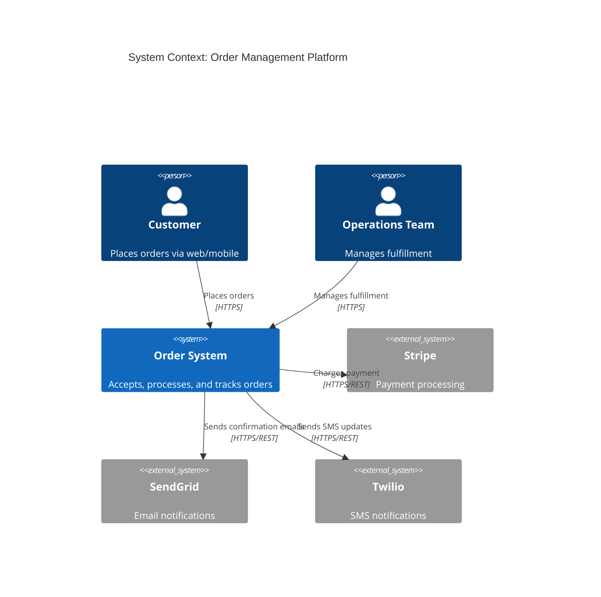
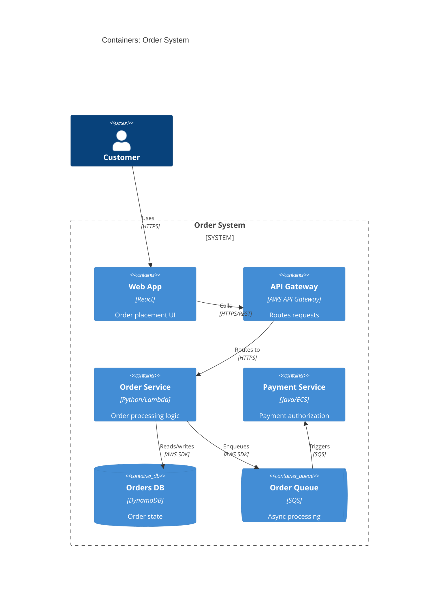
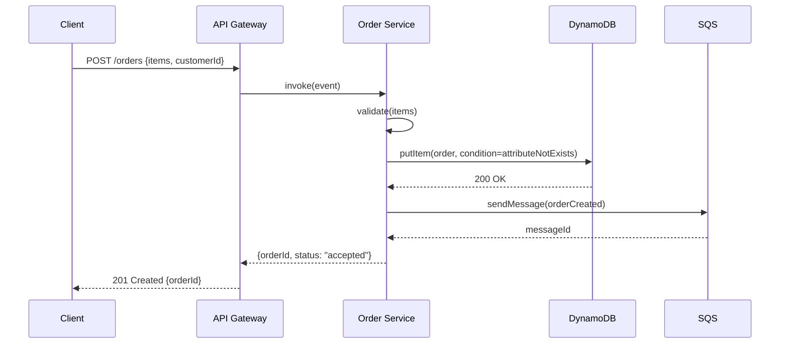
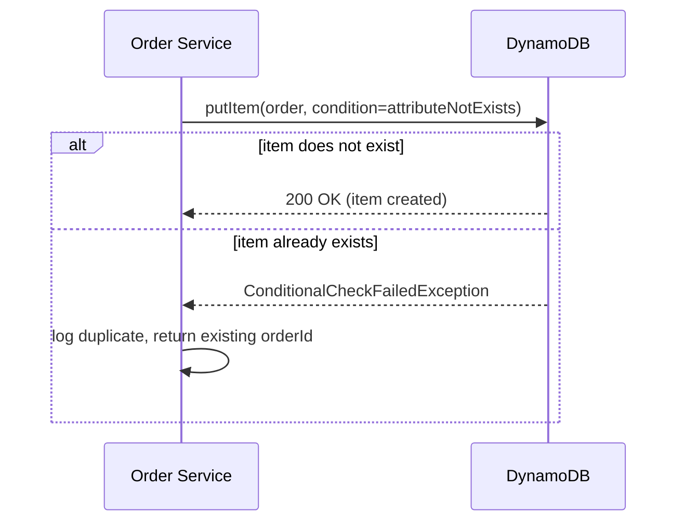
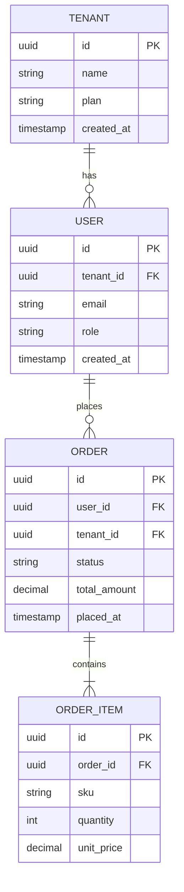
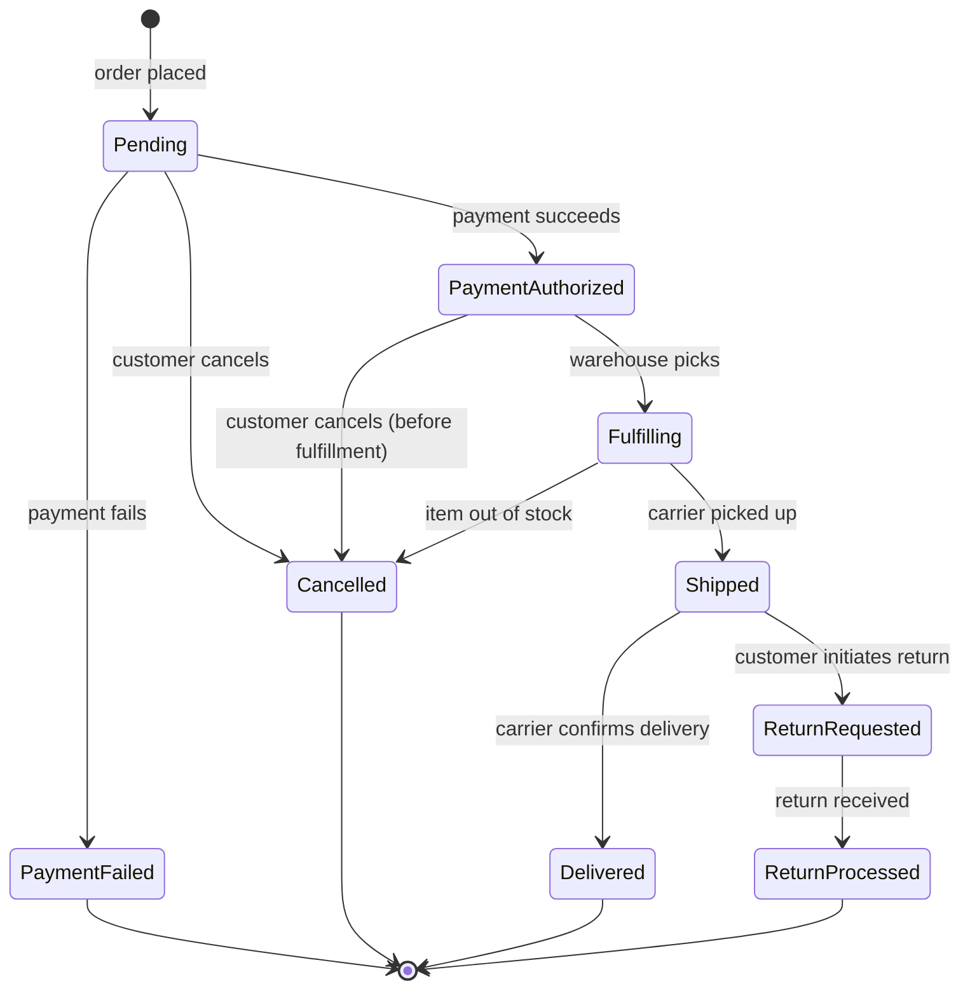
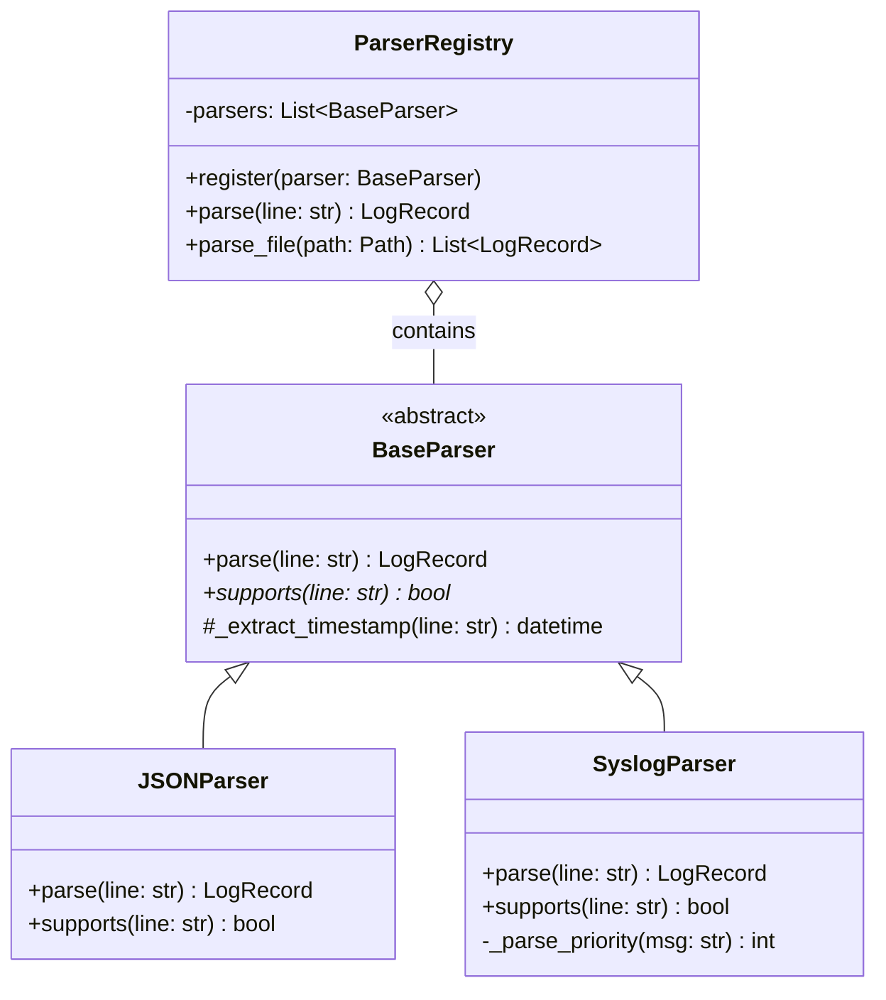

# Diagrams for AI-Readable Codebases
## Types, Formats, and Best Practices for Diagrams That Both Humans and AI Can Use

---

## The Core Problem: Most Diagrams Are Invisible to AI

A PNG or SVG diagram exported from draw.io, Lucidchart, or Excalidraw is an image file. AI coding assistants that lack vision capabilities cannot read it at all. Even AI tools with vision capabilities extract meaning from images unreliably — they may miss labels, misread relationships, or skip diagrams entirely when processing many files.

**The rule**: for documentation that AI tools should be able to use, use text-based diagram formats embedded directly in Markdown. Text-based diagrams are:
- Always readable by any AI tool
- Version-controllable (diffs show what changed)
- Rendered visually in GitHub, GitLab, and documentation sites
- Editable without a separate tool

---

## Diagram Format Decision

```
Do you need the diagram to be AI-readable?
├── Yes (architecture docs, CLAUDE.md references, code comments)
│   ├── Simple flow or relationship → ASCII art (zero dependencies)
│   ├── Component/flow/sequence/state/ERD → Mermaid (GitHub-native, widely supported)
│   ├── Detailed UML → PlantUML (powerful; requires server/plugin)
│   └── C4 model (multi-level architecture) → Mermaid C4 or structured text
└── No (design/UX, presentations, external stakeholder docs)
    └── Any tool is fine: Excalidraw, draw.io, Figma, Lucidchart
        └── Export PNG/SVG for embedding; keep source file in repo
```

---

## Mermaid: The Default Choice for AI-Readable Diagrams

Mermaid is a text-based diagramming language that renders natively in GitHub, GitLab, Notion, Obsidian, and most documentation site generators. It lives in fenced code blocks — no external tool needed.

````markdown
```mermaid
[diagram definition]
```
````

GitHub renders these automatically. AI tools read the raw Mermaid syntax and understand it as a structured description of relationships.

### Mermaid Diagram Types

| Diagram Type | Mermaid Keyword | Best For |
|-------------|----------------|---------|
| Flowchart | `flowchart LR` / `graph TD` | Data flow, decision logic, process steps |
| Sequence | `sequenceDiagram` | API calls, inter-service communication, request/response |
| Entity-Relationship | `erDiagram` | Database schema, data model relationships |
| Class | `classDiagram` | Object model, inheritance, composition |
| State machine | `stateDiagram-v2` | Object lifecycle, workflow states |
| C4 Context | `C4Context` | System landscape, who uses what |
| C4 Container | `C4Container` | Services/apps within a system boundary |
| Git graph | `gitGraph` | Branching strategy |
| Gantt | `gantt` | Roadmap (rarely needed in code docs) |

---

## The C4 Model: Best Framework for Architecture Documentation

The C4 model (by Simon Brown) describes architecture at four levels of zoom. For AI tool comprehension, the first three levels are most valuable:

| Level | Question Answered | Audience |
|-------|-----------------|---------|
| **L1: System Context** | What does this system do, and who/what interacts with it? | Anyone |
| **L2: Container** | What applications/services make up the system? | Developers, architects |
| **L3: Component** | What major components exist inside a container? | Developers |
| **L4: Code** | How is a component implemented? | Usually generated from code |

### Why C4 Works Well for AI

C4 forces you to think at multiple levels of abstraction. When an AI tool reads L1 + L2 diagrams, it understands:
- What the system's external boundary is (prevents generating code that calls the wrong system)
- What the major services are and their responsibilities (prevents generating code in the wrong layer)
- What external dependencies exist (informs which SDKs and APIs to use)

### C4 Level 1 — System Context (Mermaid)



### C4 Level 2 — Container (Mermaid)



---

## Sequence Diagrams: Best for API and Inter-Service Flows

Sequence diagrams answer "what calls what, in what order, with what data?" — precisely the information AI needs to generate correct integration code.



**What AI learns from this**: the exact call chain, the conditional DynamoDB write, the async queue pattern, and the response shape — all in one readable artifact.

### Sequence Diagram Best Practices for AI

- Use `participant` aliases that match your actual class/service names
- Label every arrow with the method or endpoint being called
- Show return arrows (`-->>`) for responses; omit only when truly fire-and-forget
- Include error paths as separate `alt`/`else` blocks for the most common failure modes:



---

## Entity-Relationship Diagrams: Best for Data Models

ERDs tell AI tools what fields exist, their types, and how entities relate — critical for generating correct queries and migrations.



**Why this matters for AI**: an AI with the ERD will generate `JOIN` conditions correctly, know which foreign keys exist, and understand cardinality — without reading the raw migration files.

---

## ASCII / Text Art: No-Dependency Option

For CLAUDE.md, code comments, and ADRs where Mermaid may not render, ASCII diagrams are universally readable by all AI tools. They are always parseable as text.

```
Data Flow:

Client
  │ HTTPS POST /orders
  ▼
API Gateway ──── validates auth ──▶ 401 if invalid
  │
  │ Lambda invoke
  ▼
Order Service
  │                     │
  │ DynamoDB PutItem    │ SQS SendMessage
  ▼                     ▼
Orders Table       Order Queue
                        │
                        │ Lambda trigger
                        ▼
                   Payment Service
```

### ASCII Best Practices for AI

- Label every arrow with the operation being performed
- Use consistent arrow styles (`──▶`, `│`, `▼`) within a diagram
- Add a one-line title or caption above the diagram
- Keep diagrams narrow enough to read without horizontal scrolling (≤80 chars)
- Use box-drawing characters (`┌─┐│└─┘`) for component boxes:

```
┌──────────────┐     ┌──────────────┐     ┌──────────────┐
│  Web Client  │────▶│ API Gateway  │────▶│Order Service │
└──────────────┘     └──────────────┘     └──────┬───────┘
                                                  │
                                         ┌────────▼───────┐
                                         │   DynamoDB     │
                                         └────────────────┘
```

---

## State Diagrams: Best for Object Lifecycle

When AI generates code that creates or transitions objects, it needs to know the valid states and allowed transitions. State diagrams provide this:



**What AI learns**: valid status values, which transitions are allowed, and implicitly which transitions are NOT valid (e.g., `Shipped → Pending` is not in the diagram → don't generate that code).

---

## Class Diagrams: Best for OOP Structure

For object-oriented codebases, class diagrams communicate inheritance, composition, and interface relationships:



---

## Diagram Placement Strategy

| Diagram | Where It Lives | When AI Uses It |
|---------|---------------|----------------|
| C4 L1 System Context | `docs/ARCHITECTURE.md` or `ARCHITECTURE.md` | Understanding system boundary |
| C4 L2 Container | `docs/ARCHITECTURE.md` | Understanding service topology |
| Sequence (key flows) | `docs/ARCHITECTURE.md` or `docs/flows/` | Generating integration code |
| ERD | `docs/ARCHITECTURE.md` or `docs/schema.md` | Writing queries and migrations |
| State machine | `docs/ARCHITECTURE.md` or inline in model class | Generating state transition code |
| Class diagram | Per-module `README.md` or `docs/` | Navigating OOP structure |
| ASCII flow | `CLAUDE.md`, ADRs, code comments | Always-available context |

---

## What Makes a Diagram AI-Readable

Regardless of format, AI tools extract more value from diagrams that follow these rules:

1. **Label every node with the actual name** — use `Order Service`, not `Service B`
2. **Label every arrow with the operation** — `calls validateOrder()`, not just `→`
3. **One concept per diagram** — don't combine architecture + sequence + ERD into one
4. **Include a title** — a single sentence above the diagram stating what question it answers
5. **Match names to code** — use the same class/service/table names as in the actual codebase; diagrams that use aliases diverge from reality and mislead AI
6. **Text summary alongside** — for complex diagrams, add 3–5 bullet points below summarizing the key relationships in prose; AI can cross-reference text + diagram

---

## Quick Reference: Diagram Type → Question Answered

| Question | Diagram Type |
|----------|-------------|
| What does this system do and who uses it? | C4 L1 Context |
| What services/apps make up the system? | C4 L2 Container |
| What components are inside a service? | C4 L3 Component |
| What calls what, in what order? | Sequence diagram |
| What fields/tables exist and how are they related? | ERD |
| What states can an object be in and how does it transition? | State machine |
| What classes exist and how do they relate? | Class diagram |
| How does data move from A to B? | Flowchart or ASCII flow |
| What are the valid inputs/outputs at each step? | Flowchart with decision nodes |
