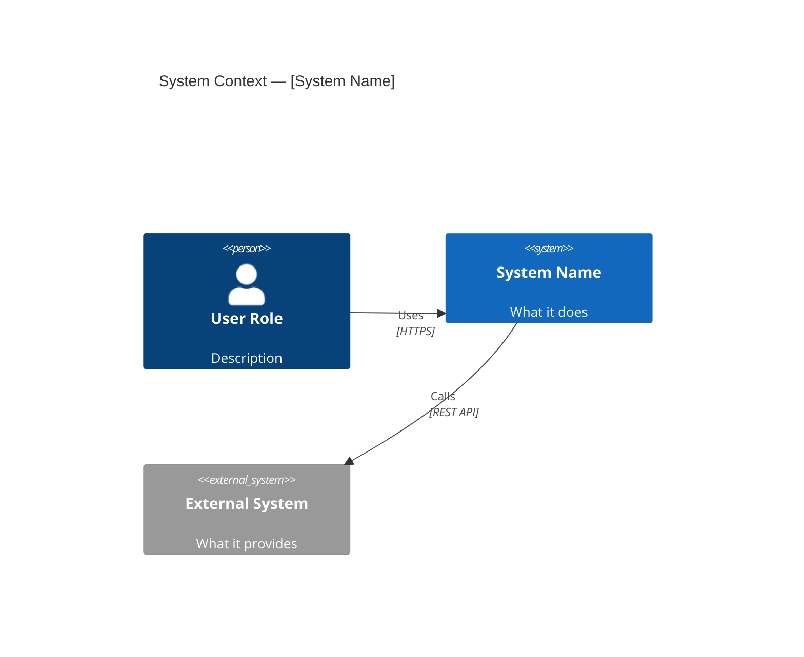

# Viewtypes and Perspectives

A unified framework for analyzing software systems, synthesized from three
complementary methodologies:

- **SEI Views and Beyond** — Three viewtypes (Module, C&C, Allocation) with architectural styles
- **C4 Model** — Four zoom levels (Context, Container, Component, Code) with supplementary diagrams
- **Rozanski & Woods** — Seven viewpoints with ten cross-cutting perspectives

## Table of Contents

- [Viewtype Catalog](#viewtype-catalog)
- [C4 Zoom Levels](#c4-zoom-levels)
- [Cross-Cutting Perspectives](#cross-cutting-perspectives)
- [Unified Analysis Matrix](#unified-analysis-matrix)
- [Choosing What to Analyze](#choosing-what-to-analyze)

---

## Viewtype Catalog

### Module Viewtype (Static / Code-Time)

**What it shows**: How the system is structured as a set of implementation units.
**When to use**: Understanding code organization, planning changes, work allocation.

| Style | Relation | Key Question | How to Analyze |
|-------|----------|-------------|----------------|
| Decomposition | is-part-of | How are modules broken into sub-modules? | Directory tree, namespace hierarchy |
| Uses | uses (requires correct presence) | What can be built/deployed independently? | Import/require analysis |
| Generalization | is-a (inheritance) | Where are extension points? | Class hierarchies, interface implementations |
| Layered | allowed-to-use | Are dependency rules respected? | Import direction analysis, layer violation detection |

**Mermaid diagram type**: Flowchart (top-down decomposition), class diagram (generalization)

### Component-and-Connector Viewtype (Runtime)

**What it shows**: What executes at runtime and how components interact.
**When to use**: Understanding behavior, diagnosing runtime issues, performance analysis.

| Style | Components | Connectors | Key Question | How to Analyze |
|-------|-----------|-----------|-------------|----------------|
| Client-Server | Clients, Servers | Request/reply protocols | What serves what? | HTTP/gRPC endpoint analysis |
| Publish-Subscribe | Publishers, Subscribers | Event delivery | What reacts to what? | Event emitter/handler analysis |
| Pipe-and-Filter | Filters (transformers) | Pipes (data streams) | How is data transformed step-by-step? | Middleware chains, stream processing |
| Shared-Data | Data accessors | Shared data store | Who reads/writes what data? | Database access pattern analysis |
| Peer-to-Peer | Peers | Bidirectional protocols | Who talks to whom? | Service mesh, gossip protocol analysis |
| Communicating-Processes | Concurrent processes | Sync/message passing | What runs in parallel? | Thread pool, async pattern analysis |

**Mermaid diagram type**: Sequence diagram (interactions), flowchart (data flow)

### Allocation Viewtype (Mapping)

**What it shows**: How software elements map to non-software structures.
**When to use**: Deployment planning, team organization, build system understanding.

| Style | Maps | Key Question | How to Analyze |
|-------|------|-------------|----------------|
| Deployment | Software → Hardware/infrastructure | Where does each component run? | Dockerfile, k8s manifests, terraform, cloud config |
| Implementation | Modules → File/directory structure | Where is the source code? | Directory tree vs logical module mapping |
| Work Assignment | Modules → Teams/people | Who owns what? | CODEOWNERS, git blame, git shortlog |

**Mermaid diagram type**: Deployment diagram (C4 deployment), flowchart

---

## C4 Zoom Levels

The C4 model provides four levels of zoom, each answering different questions
for different audiences. Use these to guide how deep to go.

### Level 1: System Context

```
Scope:     The entire system as a single box
Audience:  Everyone (technical and non-technical)
Shows:     System + users + external systems it connects to
Omits:     All internal structure, technology details
Question:  What is this system and what surrounds it?
Freshness: Changes very slowly
```

**How to identify elements**:
- The system itself (from README/project description)
- Users: Who calls the API? Who uses the UI? Who triggers batch jobs?
- External systems: What third-party APIs, databases-as-service, auth providers,
  payment gateways, email services does it connect to?

**Mermaid template**:


### Level 2: Container

```
Scope:     Inside the system boundary
Audience:  Technical people
Shows:     Applications, data stores, their technologies, communication protocols
Omits:     Internal component structure, deployment topology
Question:  What are the major runtime building blocks?
Freshness: Changes relatively slowly
```

**How to identify containers**:
- Each entry in docker-compose.yml is typically a container
- Each separately-deployed application (backend, frontend, worker)
- Each database, cache, or message broker
- Each serverless function group
- Cloud-hosted data services (S3 buckets, managed databases) are containers you own

**Key rule**: A container is a *runtime boundary*. JARs, DLLs, npm packages are NOT
containers — they are code organization within containers.

### Level 3: Component

```
Scope:     Inside a single container
Audience:  Developers
Shows:     Major functional groupings, their responsibilities, interfaces
Omits:     Individual classes/functions
Question:  How is this container organized internally?
Freshness: Changes frequently under active development
```

**How to identify components**:
1. Read the top-level directory structure within the container
2. Group related classes/modules behind their shared interface
3. Remove model/domain classes (data structures) and utility classes
4. What remains are architecturally-significant components

### Level 4: Code

```
Scope:     Inside a single component
Audience:  Developers working in that specific area
Shows:     Classes, interfaces, functions, database tables
Omits:     Nothing — full detail
Question:  How is this component implemented?
Freshness: Changes constantly — do not maintain manually
```

**When to produce**: Only when a user asks about a specific area, or when a
component is particularly complex and non-obvious. Never attempt to document
all components at code level.

### Supplementary C4 Diagrams

| Diagram | Purpose | When to Create |
|---------|---------|----------------|
| System Landscape | All systems in the organization | Large orgs with many systems |
| Dynamic | Runtime collaboration for a specific flow | Complex interactions, debugging |
| Deployment | Infrastructure topology per environment | Ops concerns, production architecture |

---

## Cross-Cutting Perspectives

Perspectives are quality concerns that apply across all viewtypes. Based on
Rozanski & Woods, these are the lenses through which you examine each view.

Apply perspectives selectively — not every codebase needs every perspective analyzed.

| Perspective | Key Question | What to Look For in Code |
|-------------|-------------|--------------------------|
| **Security** | Who can do what to what? | Auth middleware, RBAC, input validation, encryption, CORS, CSP headers |
| **Performance** | Will it be fast enough? | Caching, connection pools, query optimization, pagination, indexes, lazy loading |
| **Availability** | Will it stay running? | Health checks, circuit breakers, retries, failover, redundancy, graceful degradation |
| **Evolution** | Can it change safely? | Abstractions, interfaces, feature flags, API versioning, database migrations |
| **Scalability** | Can it handle growth? | Horizontal scaling, statelessness, partitioning, queue-based load leveling |
| **Observability** | Can we see what's happening? | Logging, metrics, tracing, error reporting, dashboards |
| **Operability** | Can we run it in production? | Config management, deployment automation, runbooks, backup/restore |
| **Testability** | Can we verify it works? | Test structure, coverage, test isolation, CI pipeline, test data management |
| **Data Integrity** | Is data correct and consistent? | Transactions, constraints, validation, idempotency, conflict resolution |
| **Compliance** | Does it meet external requirements? | Audit logging, data retention, PII handling, GDPR/SOC2 controls |

### Applying Perspectives to Views

For each perspective that matters, examine it against each relevant viewtype:

```
Example: Security perspective applied to:
├── Module view → Are auth/authz modules properly isolated? Do they have clean interfaces?
├── C&C view → Are all communication channels encrypted? Is auth checked at every entry point?
├── Allocation view → Are secrets managed properly in deployment? Network segmentation?
```

---

## Unified Analysis Matrix

This matrix maps analysis questions to the right viewtype + C4 level + perspective:

| Question | Viewtype | C4 Level | Perspective |
|----------|----------|----------|-------------|
| What services make up the system? | C&C | L2 Container | — |
| How is the code organized? | Module | L3 Component | — |
| What calls what at runtime? | C&C | Dynamic | — |
| Where does it deploy? | Allocation | Deployment | — |
| Is it secure? | Cross-cutting | All levels | Security |
| Will it scale? | C&C + Allocation | L2 + Deployment | Scalability |
| Who owns what code? | Allocation | L3 Component | — |
| What are the failure modes? | C&C | L2 Container | Availability |
| Can we change X safely? | Module | L3 Component | Evolution |
| How does data flow? | C&C | Dynamic | Data Integrity |

---

## Choosing What to Analyze

### By Stakeholder Need

| Stakeholder | Priority Viewtypes | Priority Perspectives | C4 Depth |
|-------------|-------------------|----------------------|----------|
| New developer | Module (decomposition), C&C (client-server) | — | L1-L3 |
| Bug fixer | C&C (runtime flows) | Observability | L3-L4 in affected area |
| Feature developer | Module (uses, layers) | Evolution | L3 in target area |
| Operator | Allocation (deployment) | Availability, Operability | L2 + Deployment |
| Security reviewer | Cross-cutting | Security | All levels |
| Performance engineer | C&C (concurrency, shared data) | Performance, Scalability | L2-L3 |
| Architect | All viewtypes | Evolution, Scalability | L1-L3 |

### By System Type

| System Type | Emphasize | De-emphasize |
|-------------|-----------|--------------|
| Monolith | Module decomposition, layers, component interfaces | Container diagram (single container) |
| Microservices | Container diagram, communication patterns, integration points | Code-level component detail |
| Library/SDK | Public API surface, generalization, evolution | Deployment, operational concerns |
| CLI tool | Entry points, data flow, configuration | Container/deployment diagrams |
| Data pipeline | Pipe-and-filter, data flow, data integrity | Component structure |
| Event-driven | Pub/sub patterns, event schemas, eventual consistency | Synchronous request flows |
